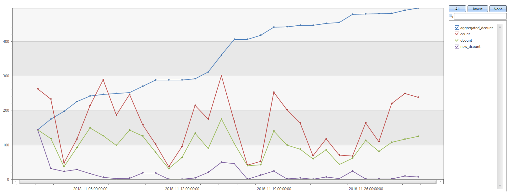
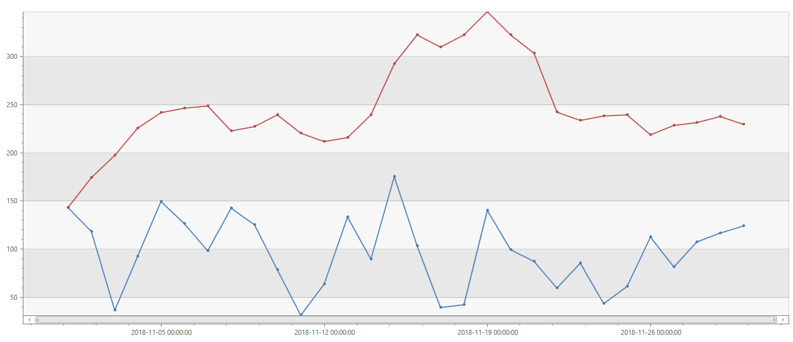
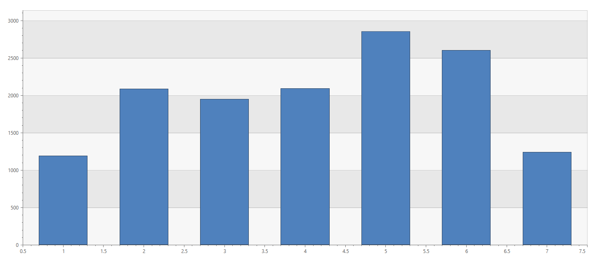
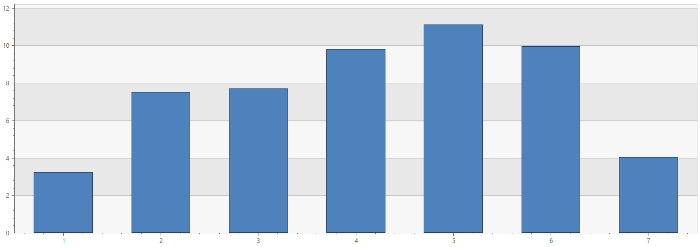
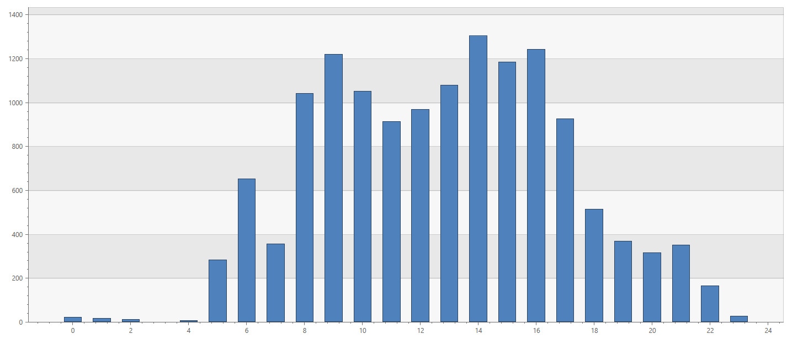

**[Go back home](../index.md)**



---

# Analyzing Spotify streaming history in Kusto (Azure Data Explorer)

*Last modified: 01/19/2019*

Like many people out there, I love listening to music, wherever I go, whenever possible.
And, like many others, I use a music streaming service to do so. My personal choice is [Spotify](https://www.spotify.com){:target="_blank"}. 

<p align="center">
  
</p>

I usually just push 'Play' without paying too much attention to what's playing, but I thought it would be nice to make some sense of what I've been listening to. And, I couldn't think of a simpler or better way to do that than using Kusto (Azure Data Explorer).

*(Some of the data points in this post have been altered for the sake of privacy)*

* TOC
{:toc}

## Getting the source data

*Did you know?* 

Spotify [makes it possible](https://support.spotify.com/us/account_payment_help/privacy/data-rights-and-privacy-settings/){:target="_blank"}
to download a list of items (e.g. songs, videos, and podcasts) you've listened to or watched in the past 90 days, including:
- Name of "creator" for each stream (e.g. the artist name if a music track).
- Name of items listened to or watched (e.g. title of music track or name of video).
- Date and time of the stream.

Once you get the "Your data is available to download" email (it could take a few days after your request), you can download the aforementioned data set in a standard JSON format, which makes it super easy to analyze in Kusto (Azure Data Explorer).

The data I used is the one in the file named `StreamingHistory.json`.
Here's an example of a few records
from it:

```
{
    "endTime": "2018-10-04 02:32",
    "artistName": "Hozier",
    "trackName": "Moment's Silence (Common Tongue)",
    "msPlayed" : 1000
}
{
    "endTime": "2018-10-04 02:35",
    "artistName": "Alex Lustig",
    "trackName": "U",
    "msPlayed" : 179425
}
{
    "endTime": "2018-10-04 02:37",
    "artistName": "Shallou",
    "trackName": "Find",
    "msPlayed" : 127103
}
{
    "endTime": "2018-10-04 02:40",
    "artistName": "King Princess",
    "trackName": "1950",
    "msPlayed" : 222211
}
```

## Ingesting the data into Kusto (Azure Data Explorer)

[Kusto.Explorer](https://docs.microsoft.com/en-us/azure/kusto/tools/kusto-explorer){:target="_blank"}
makes it super easy to [ingest](https://docs.microsoft.com/en-us/azure/kusto/tools/kusto-explorer#importing-a-local-file-into-a-kusto-table){:target="_blank"} this JSON file into a table in your Kusto database.
[I've already demonstrated it in the [Update policies for in-place ETL in Kusto (Azure Data Explorer)](update-policies.md){:target="_blank"} post.

*The entire process literally took me less than 1 minute.*

For this specific file, it's as simple as:

**1. Creating the target table**

I'll do so using the [`.create table`](https://docs.microsoft.com/en-us/azure/kusto/management/tables#create-table){:target="_blank"} command. You can choose a different table name, or different column names / order.

```
.create table SpotifyStreamingHistory (ArtistName:string, TrackName:string, EndTime:datetime, MillisecondsPlayed:long)
```

**2. Verifying the [JSON ingestion mapping](https://docs.microsoft.com/en-us/azure/kusto/management/mappings#json-mapping){:target="_blank"}**

[Kusto.Explorer](https://docs.microsoft.com/en-us/azure/kusto/tools/kusto-explorer){:target="_blank"}
does the heavy-lifting for you and auto-populates the `Mapping` field. Tou should just make sure the column names match the ones you specified when you created the table.

Here's the mapping I used:

```
[
  {
    "column": "EndTime",
    "path": "$.endTime",
    "datatype": "datetime"
  },
  {
    "column": "ArtistName",
    "path": "$.artistName",
    "datatype": "string"
  },
  {
    "column": "TrackName",
    "path": "$.trackName",
    "datatype": "string"
  },
  {
    "column": "MillisecondsPlayed",
    "path": "$.msPlayed",
    "datatype": "long"
  }
]
```

**3. Specifying the `multijson` format**

The format used in the files provided by [Spotify](https://www.spotify.com){:target="_blank"} is [supported](https://docs.microsoft.com/en-us/azure/kusto/management/data-ingestion/index#supported-data-formats){:target="_blank"} by Kusto, you simply need to choose `multijson` in the `Format` field.

Now, hit `Start` and your data will be ingested quickly into the destination table.

## Analyzing the data

Let's see how the data looks like in Kusto:

```
SpotifyStreamingHistory 
| limit 5
```

| ArtistName  | TrackName                     | EndTime                     | MillisecondsPlayed |
|-------------|-------------------------------|-----------------------------|--------------------|
| Elliot Moss | Falling Down and Getting Hurt | 2018-10-30 00:07:00.0000000 | 109930             |
| Elliot Moss | Even Great Things             | 2018-12-07 06:15:00.0000000 | 212158             |
| Elliot Moss | Big Bad Wolf                  | 2018-12-07 06:19:00.0000000 | 221954             |
| Elliot Moss | VCR Machine (Bonus Track)     | 2018-12-07 06:12:00.0000000 | 307634             |
| Elliot Moss | Best Light                    | 2018-12-07 06:24:00.0000000 | 324389             |

Great! Everything is as expected. Which means - I can start having some fun, using [Kusto's query language](https://docs.microsoft.com/en-us/azure/kusto/query/){:target="_blank"} and its rich
analytical capabilities. It goes without saying, all of these queries complete *super*-fast.

*(BTW, any comments about my musical taste are more than
welcome - I'm always open to embarrassing myself in public and get recommendations for better music!*

*(Got suggestions for more interesting queries? Let me know and I'll update the post based on your feedback)*

### Artists I'm listening to

(Apparently) these are the artists I've been listening to most during the past 90 days:

```
SpotifyStreamingHistory 
| where MillisecondsPlayed > 1000 * 60 // 1 minute
| summarize TotalListens = count(), 
            DistinctTracks = dcount(TrackName)
         by ArtistName 
| top 5 by DistinctTracks desc
| project ArtistName
```

| ArtistName        |
|-------------------|
| John Doe          |
| Janice Williams   |
| Jake Volk         |
| Jane McAllister   |
| Mickey Mouse      |

### Artists and songs I'm skipping

And these artists are the ones whose tracks I've been skipping the most during the past 90 days:

```
SpotifyStreamingHistory 
| where MillisecondsPlayed < 1000 * 60 // 1 minute
| summarize TotalSkips = count() by ArtistName 
| top 5 by TotalSkips desc
| project ArtistName
```

| ArtistName    |
|---------------|
| Captain McCain|
| Jake Volk     |
| Saul Burns    |
| John Doe      |
| Mike Ross     |

### Artist analytics

The wide set of [User Analytics plugins](https://docs.microsoft.com/en-us/azure/kusto/query/useranalytics){:target="_blank"} can be very useful and easy-to-use with these kinds of data sets. Here's an example using the [`activity_counts_metrics`](https://docs.microsoft.com/en-us/azure/kusto/query/activity-counts-metrics-plugin){:target="_blank"} plugin, which allows me to look at the total number of artists, and the number of new artists I listen to, on a daily basis, over time:

I'm very fond of playlists (mostly not created by me), so it's no wonder that the distinct number per day of artists is quite high, and the aggregated distinct count is growing quickly:

```
SpotifyStreamingHistory
| evaluate activity_counts_metrics(ArtistName, EndTime, datetime(2018-10-01), datetime(2019-01-01), 1d)
```



I can also look at the daily/weekly active artists I'm listening to, very easily using the [`activity_engagement`](https://docs.microsoft.com/en-us/azure/kusto/query/activity-engagement-plugin){:target="_blank"} plugin:

```
SpotifyStreamingHistory 
| evaluate activity_engagement(ArtistName, EndTime, datetime(2018-11-01), datetime(2018-12-01), 1d, 7d)
| project EndTime, DailyActivyArtists = dcount_activities_inner, WeeklyActiveArtists = dcount_activities_outer
| render timechart 
```



### Streaks / Binge listening

Let's see who are the artists with the longest streaks I've binge listening to:

```
SpotifyStreamingHistory 
| order by EndTime asc 
| extend row_number = row_number(1, ArtistName != prev(ArtistName))
| top-nested 10 of ArtistName by StreakLength = max(row_number)
```

| ArtistName        | StreakLength |
|-------------------|--------------|
| Jake Volk         | 50           |
| Janice Williams   | 40           |
| Hozier            | 27           |
| John Doe          | 21           |
| Mike Ross         | 20           |
| Captain McCain    | 19           |
| Jane McAllister   | 19           |
| Mickey Mouse      | 14           |
| Saul Burns        | 12           |
| Elliot Moss       | 11           |

### Activity days / hours

It looks like weekends are a litter less active, but all-in-all, music is pretty much always on:

```
SpotifyStreamingHistory 
| summarize count() 
         by Day = dayofweek(EndTime) / 1d + 1
| render columnchart
```



| Day | count_ |
|-----|--------|
| 1   | 1184   |
| 2   | 2081   |
| 3   | 1945   |
| 4   | 2084   |
| 5   | 2850   |
| 6   | 2598   |
| 7   | 1233   |

```
SpotifyStreamingHistory 
| summarize HoursPerDay = sum(MillisecondsPlayed) * 1ms / 1h
         by Day = startofday(EndTime)
| summarize AverageHoursPerDayOfWeek = avg(HoursPerDay)
         by Day = dayofweek(Day) / 1d + 1
| render columnchart
```



| Day | AverageHoursPerDayOfWeek |
|-----|--------------------------|
| 1   | 3.21183141203704         |
| 2   | 7.4968202991453          |
| 3   | 7.66869074074074         |
| 4   | 9.76917853535353         |
| 5   | 11.1009045601852         |
| 6   | 9.92619770833333         |
| 7   | 4.02422426767677         |

Now, let's zoom into active listening hours - Wanna try and guess what are the hours I go running, or use my headphones at the open space where I work?

```
SpotifyStreamingHistory 
| summarize count() 
         // I was mostly in PST timezone throughout this period
         by Hour = hourofday(EndTime - 8h)
| render columnchart 
```




| Day | count_ |
|-----|--------|
| 0   | 21     |
| 1   | 16     |
| 2   | 11     |
| 4   | 4      |
| 5   | 281    |
| 6   | 649    |
| 7   | 355    |
| 8   | 1040   |
| 9   | 1218   |
| 10  | 1048   |
| 11  | 911    |
| 12  | 966    |
| 13  | 1078   |
| 14  | 1303   |
| 15  | 1183   |
| 16  | 1239   |
| 17  | 923    |
| 18  | 512    |
| 19  | 367    |
| 20  | 313    |
| 21  | 348    |
| 22  | 163    |
| 23  | 26     |

### Random facts

Apparently, I prefer artists whose first character is in(`S`,`L`,`A`,`M`,`J`). If you would have asked me before, I'd put my money on (`K`,`U`,`S`,`T`,`O`).

```
SpotifyStreamingHistory 
| summarize count() by FirstChar = toupper(substring(ArtistName, 0, 1))
| as T
| extend Percentage = 100.0 * count_ / toscalar(T | summarize sum(count_))
| top 5 by Percentage desc
| project FirstChar, Percentage
```

| FirstChar | Percentage       |
|-----------|------------------|
| S         | 10.2754919499106 |
| L         | 8.32915921288014 |
| A         | 8.29338103756708 |
| M         | 8.22182468694097 |
| J         | 6.80500894454383 |

And, I'm not a big fan of remixes, give me the original version please:

```
SpotifyStreamingHistory 
| summarize DistinctTracks = dcount(TrackName),
            DistinctRemixedTracks = dcountif(TrackName, TrackName has 'remix')
| extend Percentage = 100.0 * DistinctRemixedTracks / DistinctTracks
```

| DistinctTracks | DistinctRemixedTracks | Percentage       |
|-----------------|-----------------------|------------------|
| 1842            | 146                   | 7.92616720955483 |

*(Got suggestions for more interesting queries? Let me know and I'll update the post based on your feedback)*

---

**[Go back home](../index.md)**

