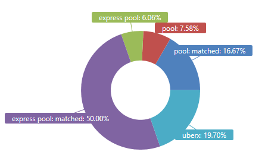
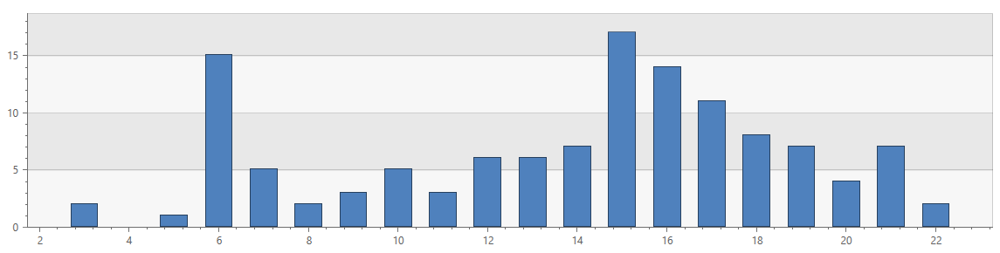
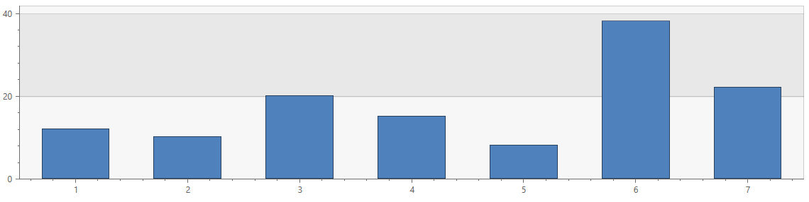
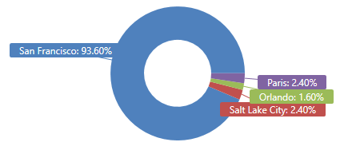
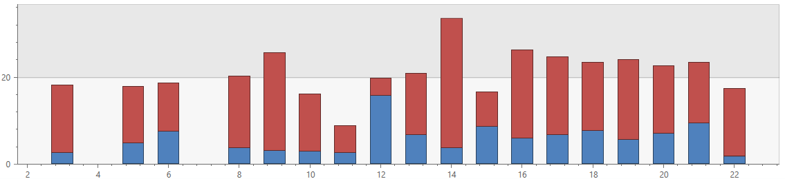
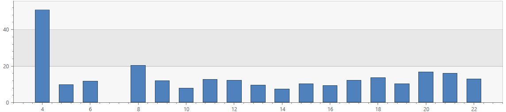

# Analyzing Uber rides history in Kusto (Azure Data Explorer)

*Last modified: 02/09/2019*

Ride-hailing and ride-sharing have seen enormous growth and adoption, which means - there is, and there will continue to be lots of data to analyze
about how people across the world are using these services, as well as comparing the level of service different companies such as
[Uber](https://www.uber.com){:target="_blank"}, [Lyft](https://www.lyft.com){:target="_blank"} and others provide to their riders and drivers.

Having recently moved to a city where these are one of the main means of day-to-day transportation, my usage of them as a rider has significantly grown.
I decided it's time to look into some data and see what I can learn from it.

Naturally, I chose **Kusto (Azure Data Explorer)** to look into it, and I took my personal data from [Uber](https://www.uber.com){:target="_blank"} for a ride.

*(Some of the data points in this post have been altered for the sake of privacy)*

<p align="center">
  
</p>

* TOC
{:toc}

## Getting the source data

*Did you know?*

Uber [makes it possible](https://help.uber.com/riders/article/download-your-data?nodeId=2c86900d-8408-4bac-b92a-956d793acd11){:target="_blank"}
to download your rides history, including properties such as:
- Time of request/beginning/end of the trip.
- Longitude/Latitude/Address of beginning/end of the trip, and the total distance.
- Fare amount and currency.

Once you get the "Your data is available to download" email (it could take a few days after your request), you can download the aforementioned data set
in a standard CSV format, which makes it super easy to analyze in Kusto (Azure Data Explorer).

The data I used is the one in the file named `trips_data.csv`.
Here's an example of a few records from it:

```
City,Product Type,Trip or Order Status,Request Time,Begin Trip Time,Begin Trip Lat,Begin Trip Lng,Begin Trip Address,Dropoff Time,Dropoff Lat,Dropoff Lng,Dropoff Address,Distance (miles),Fare Amount,Fare Currency
San Francisco,Express Pool: MATCHED,COMPLETED,2018-08-17 03:50:18 +0000 UTC,2018-08-17 03:56:45 +0000 UTC,73.7869535,-111.3922508,"999 ... St, San Francisco, CA 94105, USA",2018-08-17 04:16:43 +0000 UTC,57.779273,-222.4352993,"1111 ... St, San Francisco, CA 81445, USA",3.30,5.1,USD
San Francisco,UberX,COMPLETED,2018-08-15 19:27:02 +0000 UTC,2018-08-15 19:29:30 +0000 UTC,67.7790511087,-333.395617827,"444 ... St, San Francisco, CA 94107, US",2018-08-15 19:35:46 +0000 UTC,57.7772837419,-444.416049126,"1555 ... St, San Francisco, CA 41578, USA",1.58,9.86,USD
San Francisco,Express Pool: MATCHED,COMPLETED,2018-08-12 21:20:24 +0000 UTC,2018-08-12 21:27:40 +0000 UTC,47.7792305817,-555.434557152,"1111 ... Ave, San Francisco, CA 81445, USA",2018-08-12 21:42:51 +0000 UTC,47.7870367854,-666.392240158,"999 ... St, San Francisco, CA 94105, USA",2.77,3.33,USD
```

## Ingesting the data into Kusto (Azure Data Explorer)

Even though it's possible to get this done super-easily using [Kusto.Explorer](https://docs.microsoft.com/en-us/azure/kusto/tools/kusto-explorer){:target="_blank"},
this time I decided to show a different way, super-easy as well, using Kusto's [externaldata operator](https://docs.microsoft.com/en-us/azure/kusto/query/externaldata-operator){:target="_blank"}.
- Examples for ingestion using [Kusto.Explorer](https://docs.microsoft.com/en-us/azure/kusto/tools/kusto-explorer){:target="_blank"} can be found in my other posts:
    - [Analyzing Spotify streaming history in Kusto (Azure Data Explorer)](analyzing-spotify-streaming-history.md)
    - [Update policies for in-place ETL in Kusto (Azure Data Explorer)](update-policies.md)

*(The entire process literally took me less than 1 minute)*

1. I took the source file, `trips_data.csv` and uploaded it to Azure blob storage using [Azure Storage Explorer](https://azure.microsoft.com/en-us/features/storage-explorer/){:target="_blank"}.

2. I got a URL to the uploaded blob using a [Shared Access Signature (SAS)](https://docs.microsoft.com/en-us/azure/storage/common/storage-dotnet-shared-access-signature-part-1){:target="_blank"}.

3. I invoked the following [.set-or-append command](){:target="_blank"} against my database, to get the data ingested.
    - Note that I'm running a query against the source data before ingesting it, as the datetime format in the source data provided by [Uber](https://www.uber.com) isn't in a standard or [supported format](https://docs.microsoft.com/en-us/azure/kusto/query/scalar-data-types/datetime).
    - This also allows me to not have to create the table in advance, the command takes care of it for me.    
    - I could have achieved the same goal of pre-processing the data at ingestion time by using an [update policy](https://docs.microsoft.com/en-us/azure/kusto/management/updatepolicy){:target="_blank"}.

    ```
    .set-or-append UberRides <| 
        externaldata(
            City:string,
            ProductType:string,
            TripOrOrderStatus:string,
            RequestTime:string,
            BeginTripTime:string,
            BeginTripLat:double,
            BeginTripLng:double,
            BeginTripAddress:string,
            DropoffTime:string,
            DropoffLat:double,
            DropoffLng:double,
            DropoffAddress:string,
            Distance_Miles:double,
            FareAmount:double,
            FareCurrency:string
        )
        [h'https://account.blob.core.windows.net/container/trips_data.csv<SAS>']
        | where City != "City" // This is for filtering out the header line
        | extend RequestTime = todatetime(substring(RequestTime, 0, 19)),
                 BeginTripTime = todatetime(substring(BeginTripTime, 0, 19)),
                 DropoffTime = todatetime(substring(DropoffTime, 0, 19))
    ```

## Analyzing the data

This is by no means Big Data, and not even close to Billions of rides, which I've covered in [another post](analyzing-nyc-taxi-rides.md){:target="_blank"},
however it does allow to see the capabilities of Kusto (Azure Data Explorer) very nicely. Plus, if you hop over to that other post after reading this on,
you'll see that Kusto performs great for data sets with billions of rides too.

*(Got suggestions for more interesting queries? Let me know and I'll update the post based on your feedback)*

Let's see how the data looks like in Kusto:

```
UberRides
| limit 5
```

| City          | ProductType   | TripOrOrderStatus | RequestTime                 | BeginTripTime               | BeginTripLat  | BeginTripLng   | BeginTripAddress                                   | DropoffTime                 | DropoffLat    | DropoffLng     | DropoffAddress                               | Distance_Miles | FareAmount | FareCurrency |
|---------------|---------------|-------------------|-----------------------------|-----------------------------|---------------|----------------|----------------------------------------------------|-----------------------------|---------------|----------------|----------------------------------------------|----------------|------------|--------------|
| San Francisco | Pool          | CANCELED          | 2018-10-31 14:09:13.0000000 | 1970-01-01 00:00:00.0000000 | 57.7910804435 | -122.415729391 |                                                    | 1970-01-01 00:00:00.0000000 | 57.7911779787 | -254.416031619 | 36 12th St, San Francisco, CA 41578, USA     | 0              | 0          | USD          |
| San Francisco | Pool: MATCHED | COMPLETED         | 2018-10-31 14:10:34.0000000 | 2018-10-31 14:20:20.0000000 | 57.77923      | -122.43458     | 777 Fictional Ave, San Francisco, CA 81445, USA | 2018-10-31 14:26:57.0000000 | 75.77584      | -543.41663     | 36 12th St, San Francisco, CA 41578, USA     | 1.28           | 4.15       | USD          |
| San Francisco | Pool: MATCHED | COMPLETED         | 2018-11-02 23:10:12.0000000 | 2018-11-02 23:21:45.0000000 | 57.7757559835 | -122.416465092 | 36 120th St, San Francisco, CA 41578, USA           | 2018-11-02 23:26:07.0000000 | 34.770701054  | -176.406112678 | 555 9th St, San Francisco, CA 41578, US      | 0.81           | 4.21       | USD          |
| San Francisco | Pool: MATCHED | COMPLETED         | 2018-11-02 23:38:52.0000000 | 2018-11-02 23:46:48.0000000 | 57.77074      | -122.40782     | 555 904th St, San Francisco, CA 41578, US            | 2018-11-02 23:52:27.0000000 | 43.77511      | -211.41624     | 4100 Mission St, San Francisco, CA 41578, US | 0.64           | 4.63       | USD          |
| San Francisco | Pool: MATCHED | COMPLETED         | 2018-11-03 21:53:36.0000000 | 2018-11-03 21:59:40.0000000 | 57.77925      | -122.43445     | 777 Fictional Ave, San Francisco, CA 81445, USA | 2018-11-03 22:12:33.0000000 | 12.77593      | -122.41673     | 36 12th St, San Francisco, CA 41578, USA     | 1.74           | 4.62       | USD          |

Now, I can start having some fun, using [Kusto's query language](https://docs.microsoft.com/en-us/azure/kusto/query/){:target="_blank"} and its rich
analytical capabilities. All of these queries complete *super*-fast, no surprises here.

### The basics

I can see the Uber service I use the most:

```
UberRides
| as hint.materialized = true T
| summarize Percentage = round(100.0 * count() / toscalar(T | count), 2)
         by ProductType = tolower(ProductType)
| render piechart 
```



I can also see percentiles of my rides length (miles and duration) and cost (in USD):

```
UberRides
| extend WaitDuration = BeginTripTime - RequestTime,
         TripDuration = DropoffTime - BeginTripTime
| summarize percentiles(WaitDuration, 50, 75, 90),
            percentiles(TripDuration, 50, 75, 90),
            percentiles(FareAmount, 50, 75, 90),
            percentiles(Distance_Miles, 50, 75, 90)
| evaluate narrow()
| project-away Row
```

| Column                       | Value    |
|------------------------------|----------|
| percentile_FareAmount_50     | 4.21     |
| percentile_FareAmount_75     | 6.25     |
| percentile_FareAmount_90     | 24.81    |
|                              |          |
| percentile_TripDuration_50   | 00:08:09 |
| percentile_TripDuration_75   | 00:16:23 |
| percentile_TripDuration_90   | 00:24:35 |
|                              |          |
| percentile_WaitDuration_50   | 00:06:28 |
| percentile_WaitDuration_75   | 00:09:09 |
| percentile_WaitDuration_90   | 00:12:51 |
|                              |          |
| percentile_Distance_Miles_50 | 1.91     |
| percentile_Distance_Miles_75 | 3.38     |
| percentile_Distance_Miles_90 | 12.75    |

And, what are the most popular hours of day, and days of week I user the service:

```
UberRides
| summarize count() by hourofday(RequestTime-8h)
| render columnchart 
```



```
UberRides
| summarize count() by dayofweek(RequestTime-8h) / 1d + 1
| render columnchart
```



Wanna guess where I live?

```
UberRides
| as hint.materialized = true T
| summarize Percentage = round(100.0 * count() / toscalar(T | count), 2)
         by City
| render piechart 
```



### Cost and efficiency

This is one person's data, so any attempt to deduce global patterns out of it won't be meaningful.

Still, some of these could be interesting, e.g. trying to anticipate which hours/days are more
congested, more popular, and perhaps more pricey.

Let's look into the wait and ride durations, and try to figure out how long in advance I should book my ride.

This query shows the average wait durations and average trip durations by the hour of day, for trips taken
in San Francisco:

```
UberRides
| where Distance_Miles < 15
| where City == "San Francisco"
| where DropoffTime > datetime(2018-01-01)
| extend WaitDuration = BeginTripTime - RequestTime,
         TripDuration = DropoffTime - BeginTripTime
| summarize AvgWaitDurationMins = avg(WaitDuration)/1m, 
            AvgTripDurationMins = avg(TripDuration)/1m
         by hourofday(RequestTime-8h)
| render columnchart with(kind = stacked)
```



The following query shows the average MPH by hour of day, for the same set of trips:

```
UberRides
| where Distance_Miles < 15
| where City == "San Francisco"
| where DropoffTime > datetime(2018-01-01)
| extend TripDurationHrs = (DropoffTime - BeginTripTime) / 1h
| summarize avg(Distance_Miles / TripDurationHrs) by hourofday(BeginTripTime-8h)
| render columnchart 
```




You can say many things about [living in San Francisco](https://sf.curbed.com/2018/6/4/17415618/move-to-san-francisco-advice-guide){:target="_blank"},
but one thing you can't ignore it the cost of living. Choosing when you go to certain places could perhaps save you some
money.

This query shows the average cost (USD per minute) by day of week and hour of day. You can see that for
my rides, Wednesday around 11PM and Friday around 1PM were the priciest, on average:

```
UberRides
| where Distance_Miles < 10
| where City == "San Francisco"
| where DropoffTime > datetime(2018-01-01)
| extend TripDurationMins = (DropoffTime - BeginTripTime) / 1m
| extend UsdPerMin = FareAmount / TripDurationMins,
         DayOfWeek = toint(dayofweek(RequestTime-8h) / 1d + 1),
         HourOfDay = hourofday(BeginTripTime-8h)
| summarize round(avg(UsdPerMin),2) by Day_Hour = strcat(DayOfWeek, "_", HourOfDay)
| top 10 by avg_UsdPerMin desc 
```

| Day_Hour | avg_UsdPerMin     |
|----------|-------------------|
| 4_11     | 1.57              |
| 6_13     | 1.30              |
| 3_8      | 1.03              |
| 3_18     | 0.91              |
| 7_20     | 0.87              |
| 6_12     | 0.76              |
| 6_15     | 0.73              |
| 6_20     | 0.68              |
| 6_6      | 0.65              |
| 3_6      | 0.62              |

This is a similar query, which looks at the average cost (USD per mile). By this measurement, Wednesday around 11PM and Friday around 1PM are still the priciest, but in a different order than above:

```
UberRides
| where Distance_Miles < 10
| where City == "San Francisco"
| where DropoffTime > datetime(2018-01-01)
| extend TripDurationMins = (DropoffTime - BeginTripTime) / 1m
| extend UsdPerMile = FareAmount / Distance_Miles,
         DayOfWeek = toint(dayofweek(RequestTime-8h) / 1d + 1),
         HourOfDay = hourofday(BeginTripTime-8h)
| summarize round(avg(UsdPerMile), 2) by Day_Hour = strcat(DayOfWeek, "_", HourOfDay)
| top 10 by avg_UsdPerMile, 2 desc 
```

| Day_Hour | avg_UsdPerMile   |
|----------|------------------|
| 6_13     | 8.37             |
| 4_11     | 6.24             |
| 3_18     | 4.57             |
| 6_15     | 4.33             |
| 7_10     | 3.97             |
| 6_12     | 3.84             |
| 3_6      | 3.47             |
| 6_17     | 3.29             |
| 6_20     | 3.18             |
| 3_8      | 3.09             |

### Random facts

My rides in the city stay mostly within the same small set of zip codes:

```
UberRides
| where BeginTripAddress has 'San Francisco, CA' and DropoffAddress has 'San Francisco, CA'
| parse BeginTripAddress with * 'San Francisco, CA ' FromZipCode:int ', US' *
| parse DropoffAddress with * 'San Francisco, CA ' ToZipCode:int ', US' *
| summarize count() by FromZipCode, ToZipCode
| top 10 by count_ desc
```

| FromZipCode | ToZipCode | count_ |
|-------------|-----------|--------|
| 94103       | 94103     | 21     |
| 94115       | 94103     | 17     |
| 94103       | 94105     | 9      |
| 94105       | 94103     | 4      |
| 94105       | 94115     | 4      |
| 94115       | 94105     | 4      |
| 94109       | 94105     | 3      |
| 94103       | 94115     | 3      |
| 94123       | 94103     | 3      |
| 94102       | 94115     | 2      |

Also, 8 characters is a somewhat popular length for a street name. Here's the number of distinct streets
I've gone from or to, by their name length:

```
UberRides
| project Address = pack_array(BeginTripAddress, DropoffAddress)
| mv-expand Address to typeof(string)
| where isnotempty(Address)
| where Address has "St, San Francisco, CA" 
| where Address matches regex @"^\d+" // places which start with a number
| parse kind=regex Address with @"[^\s]+ " Street "St, San Francisco, CA" *
| summarize dcount(Street), SampleNames = strcat_array(make_set(Street, 3), ", ") by strlen(Street)
| order by dcount_Street desc
```

| strlen_Street | dcount_Street | SampleNames                 |
|---------------|---------------|-----------------------------|
| 8             | 8             | Fremont , Brannan , Vicente |
| 5             | 7             | 10th , Fell , 11th          |
| 7             | 6             | Howard , Pierce , Haight    |
| 4             | 4             | 9th , Bay , 3rd             |
| 6             | 4             | Union , Hayes , Scott       |
| 9             | 2             | Chestnut , Harrison         |
| 10            | 1             | O'Farrell                   |
| 11            | 1             | McAllister                  |

*(Got suggestions for more interesting queries? Let me know and I'll update the post based on your feedback)*

---

