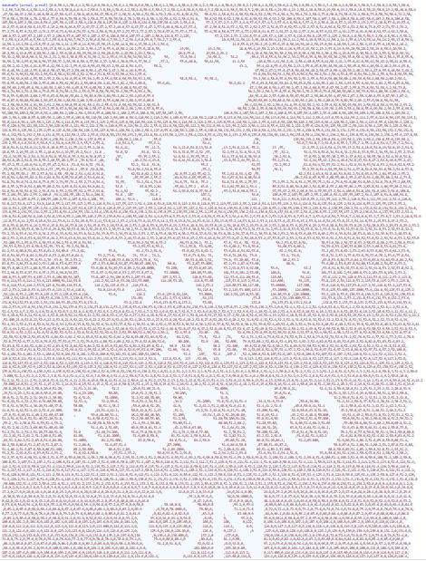
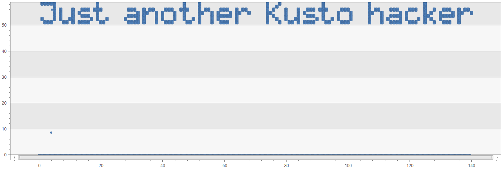
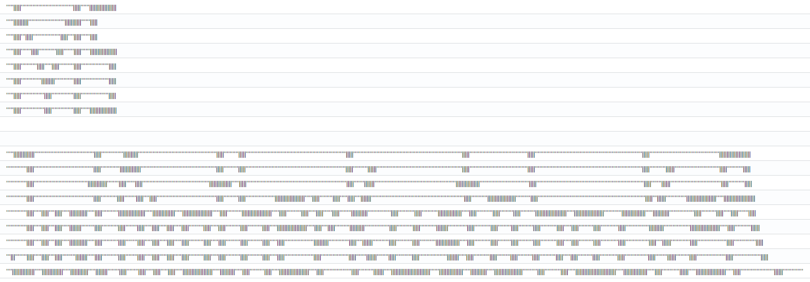



---

# Just another Kusto hacker *(JAKH)*

*Last modified: 11/08/2018*

Back in 2017, the Kusto (Azure Data Explorer) team came up with yet another brilliant idea:
Many people simply love our query language, why don't we challenge them with writing creative, thought-provoking,
and even crazy queries, which will all be required to output the same string: `Just another Kusto hacker`
(following the well-known, and similar-in-spirit, [Just another Perl hacker](https://en.wikipedia.org/wiki/Just_another_Perl_hacker){:target="_blank"}).

When we started this contest, we had no expectation that the queries it would yield will be so impressive and amazing.
Dozens of people within Microsoft participated in the contest (even though the prizes we offered were rather modest). They have proven they are true **Kusto hackers**.

Now, are *you* up for the challenge?

* TOC
{:toc}

# And the Prize goes to ...

## 1st place

The 1st place was given to a query that impressed us with its naive looks,
yet brave brute-force explosion of all possible 5-grams coming from the string `JKacehknorstu`.  

The query forms a table with 14^5 (537,824) rows using [mv-expand](https://docs.microsoft.com/en-us/azure/kusto/query/mvexpandoperator){:target="_blank"}, over the 'L'-string characters.
This table represents all possible combinations of the 5-grams of these characters.
Then, 5 elements that have the 'right' combinations are selected using hash values, to form the final 25 character output.

[*Click to run*](https://dataexplorer.azure.com/clusters/help/databases/Samples?query=H4sIAAAAAAAAA1VRS2vDMAy+51eYXOpAO2zZsZ3BYMeyZece2g681LRp8yJ2tzL24yd3ZTQyWEjfp/cw1l0gJXkiKXl5tZU7nLp+9OGcJj9kGPujq/5gdwmjrYJtGjqjD9lsTsrsnsKRU6ITblrctLzpPGoMaD/dZbDdLkZMTJiaYmrKqZnflV5hZh/GygZa8thBrB4rx6qxR2zdYdASeQfrD3SVxWTHvu5IQhOCsrMB30fjCF0+Nn23R0b0r68/SrqQioERWuVcGzAFKCbSOfnHDS9EIXOmCgUStGb6Hl0o0EpIrgoOQnAFAGqCG5aDZkUBgkklMRmbhvNcg9KSG8GEkFoanV7RbZKRviNLnMef29aO9bcjb857u3c47uiGBm9Kn2fr983Xxm/xbClmDj0urO72tLUn19Q+4E6y7BdMe23hDAIAAA==){:target="_blank"}
```
print L = " JKacehknorstu"
| project L = extract_all('(.)', L)
| project L1 = L, L2 = L, L3 = L, L4 = L, L5 = L
| mv-expand L1 
| mv-expand L2 
| mv-expand L3 
| mv-expand L4 
| mv-expand L5
| project W = strcat(L1, L2, L3, L4, L5)
| extend H = hash(W) 
| join 
(
    datatable (H:long) 
    [
       "-4602837651782892603", 
       "819394506962427707", 
       "-6276341691233162226", 
       "-805270992304648190", 
       "-6157267418303347487"
    ]
) on H
| summarize Message = replace(@'[^\w\s]', "", tostring(make_list(W)))
```

## 2nd place

This query (from [Ben Martens](https://blogs.msdn.microsoft.com/ben/){:target="_blank"}) got us excited with its ASCII-art-creation
of `Keep Calm and Kusto on`, with the desired result rendered as a scatter-chart.

*Download the query as a [CSL file](../resources/csl/jakh-2nd-place-query.csl)*

**Query screenshot:** (too long to paste as text :-) )



**Output:**



## 3rd place (#1):

The "Emoji query" below (from [Joaquín Ruales](https://joaquin.rual.es/){:target="_blank"}) shows some genuine magic.  
It looks simple and perhaps like a bluff, until a light touch of `abracadabra` turns the emojis into a real message.
Oh, you don't believe it works? Try it yourself!

[*Click to run*](https://dataexplorer.azure.com/clusters/help/databases/Samples?query=H4sIAAAAAAAAA01OS4rCQBDde4omm+7GIAgy4EKYC8wJVKSSFBLMj3QrIl5AycKFCxGZIAgK6hxhzpQjzOvBhYvXVbxfdVHGmRU0kE192DT17qep9w/MJ/AL7oh5BW5NXTnuDHwDd/igV1t4kNkhs4deOZ/jnQ/Zwwn7BUCmusvWWvDSchbhIpaSQktJoqTqaOkL0tDTBS8Lco53s5kHxuKrUxWQ4Y/ehLMwj/jFYYRklaQAjRS58V+nfdHtu1IzT1Mq4xWLLzaGpjwouUgoZPUph+0xzFLgeSOHnj8aO8HzfGHz16GUZpzExip0a/0HguPVQDwBAAA=){:target="_blank"}
```
print a='😉🐮🔬🐭🐾😚🐧🐨🌭🐡🐞🐫🔾🌊😮🐬🔭🌨🌾🌡🐚😜🌤🌞🌫'
| extend a=extract_all('(.)', a)
| mv-expand a
| extend a=substring(base64_encodestring(strcat('abracadabra', a)), 19)
| summarize Message=replace(@'[+]', ' ', replace(@'[[",\]]', "", tostring(make_list(a))))
```

## 3rd place (#2)

The query below 'takes a bet' on the calculation of percentiles (69.8, 39.6, 35.8, ...) over a random sequence of numbers.
The percentiles are then used to select the characters that form the output message.
Yeah, it might be that if you run the query below enough times - you won't get the desired output.
But despite the risk this query takes, it never (yet) happened to us, throughout extensive testing.
Want to see it break? Reduce N to '1000' and check the output.

[*Click to run*](https://dataexplorer.azure.com/clusters/help/databases/Samples?query=H4sIAAAAAAAAA21SwY7aMBC95ytGuWCv3CiGBRatkLb37arqsUlUmWQWvDhO6phdQP34ThIILK0PkfX83puZNzHo4QWWIOPuPAaGAGXqjVrRZQkhqFVe4Ot6o9+2prRV/ds1fvf+sT8cw8egdtp6+HrhN97lyrOzgwBf7eoa3YBwHvwB3Hu0BTyj9+gakhHgVO6VMewpZEn6ARkPxWB8pXnZlate45RdI4sFjOGurWvQXqrAF5AC5JXwp6Y+CtIddc1OlcXZruWV77iv1cC8bZOUvqIy2q5Zz0ji7J/GOhZlcqbIjvJGEGy1LZZOrzcUSevHAqDTTQE/uu+rq0qQZEAraTzWIDvKUIJYBTG60QvGT4/NriyV00eE7+jyNhnKO0frtcHml3JOHVivFFAcrCp1zpLZInoQk0U0E5Npe5tHcxELGS3EeBbdi/FDNOlBOY2kWBA0uSfCXBJ0I+u4cU9sDaYtFtNrr8r4udEh4K7Pz6PdpDeO4v8t9a6X8oBDZU+a4DqBflXPumn/xVJt0dD1tG3+ifkNm0ZR5hQm1kblyJ5GSZqkYSrSLBsJGI3EZeE3Vm0BzvlfdVA+ZT0DAAA=){:target="_blank"}
```
let N = 1000000;
let alphabet = " abcdefghijklmnopqrstuvwxyz";
print Alphabet = strcat(alphabet, toupper(alphabet))
| extend Letters = extract_all(@"([\w ])", Alphabet)
| extend Numbers = range(0, 2 * strlen(alphabet) - 1, 1)
| extend Zipped = zip(Letters, Numbers)
| mv-expand Zipped
| extend Letter = tostring(Zipped[0])
| extend Number = toint(Zipped[1])
| join kind=rightouter (
    range Range from 1 to N step 1
    | extend Random = rand()
    | summarize Percs = percentiles_array(Random, dynamic([69.8,39.6,35.8,37.7,0,1.9,26.4,28.3,37.7,15.1,9.4,34,0,71.7,39.6,35.8,37.7,28.3,0,15.1,1.9,5.7,20.8,9.4,34]))
    | mv-expand Percs
    | extend Number = toint(2.0 * strlen(alphabet) * Percs)
) on Number
| summarize LetterList = make_list(Letter)
| summarize Message = replace(@'[\[\"\,\]]', '', tostring(make_list(LetterList)))
```

# *"Wow!"* queries

These queries did not win the prizes - but looking at them caused a genuine *"WOW!"* reaction.  
They did reach the final round of the competition, and you can definitely see why.

## 1. Kusto ASCII Art

[*Click to run*](https://dataexplorer.azure.com/clusters/help/databases/Samples?query=H4sIAAAAAAAAA81UTY/TMBC951cMvdiRIpmk3YXtKhLiAAeEtBLc2h68qdmmTePIHxLQ8t+J4zjf2V1xYnpwY2fee/Nm4owpAAoxYGii4HKd5sq/mIc9VeXvMWPuFEPGlGIC1k2CVCLNn/wNomh3ZT8Vy/fu6IHLuMT7A/cmDZKKqSEYgRt8C792oNALQr4faH6ShHgAKBnyObp7+2goWbc4xwyXemNcXqe6WgJsEGuJGgoDfmjBW+gW09XSiP+ipeKkEt+i20N0GBQzqMVWcwTH2OtSE1OODssaRNO940yRpxhb5xk9wycuvKGPE6QjPssCrlx0Go3KfIycaMPoy/vj66JrECEfdZrtSwVeT++gQX1HXGcA5bNzbceaTysYyRjEXLNMdAwk5JtODkDHY4P42MXJsRHPCPxHhRP3gIuuREI+C0aVnXkkXphxo1XOf7CT98WsjmEb20ByZtRVjHtu9KeloexNzfCiQuoVt5KeacgzvYCeA7PXJCEPgu91ot4Yw/XEZzZpekET1hbfJ72MWKfFzRveeAMTxnfOSRMeIbMo/314Ok95jjUOb3w/wDl+Z5YjDs2icWQWicNbsyq8qh5NA3C4tFthlSBwVOWX+1XmCYcru0ZLux+t7Hth1MG4M/8THFV7Bxy+NSvFUYXBcfje0i/blBt7Uh1QD9e67mx+VOZfoW6a7X+cpj9w2T9Ic8BhUKoKFNdFwUQ9IH5Qr1cu9uW3+fjLtBuoTK5Sn89UpL9ZjSXjMz2xLJXK5V4LwY8sUfCVSUmfWCxYkRmZH9Bmu9kutsF2t0PBYlGS2pGrM6Xv/wUbepvw0AgAAA==){:target="_blank"}
```
  let  a = (          pos:int){    datatable        ( letter :         string)['a']|extend        Pos=pos} ; let c = ( pos:int){datatable           (letter:string)[              //Thanks//
  'c']|extend       Pos=pos};      let e = (        pos:int) {       datatable        (letter :   string) ['e']|extend Pos=pos};let h = (      pos:int) {datatable (letter:       //Kusto///
   string) [      'h']|extend      Pos=pos};        let j  = (    pos:int){             datatable               (letter :                  string)['j']|extend Pos=pos};let k=(   //Team For
  pos:int) {    datatable          (letter :        string ) [     'k']|extend                                  Pos=pos};                  let n = (                  pos:int){   //Building
   datatable (letter:              string) [       'n']|extend        Pos=pos}; let o = (                       pos:int){                  datatable                   (letter :  //Such a//
   string) [   'o']|extend         Pos=pos};        let r = (                        pos:int){                  datatable                  ( letter :                 string) [   //Great///
  'r']|extend      Pos=pos};       let s = (        pos:int) {    datatable           ( letter :                string) [                 's']|extend Pos=pos};let t=(pos:int){    
   datatable         (letter:      string)[        't']|extend       Pos=pos};      let u = (                   pos:int){                       datatable(letter:string)[         //Product!
  'u']|extend          Pos=pos};       let space=(pos:int)              {datatable(letter:                      string) [                         ' ']|extend Pos=pos};           //////////
//                                                                                                                                                                                          
union(u(15)),(n(7)),(j(1)),(u(2)),(s(16)),(t(4)),(space(13)),(t(17)),(r(25)),(e(11)),(k(14)),(k(23)),(e(24)),(r(12)),(space(19)),(c(22)),(h(10)),(a(21)),(o(18)),(s(3)),(space(5)),(o(8)),(a
(6)),(t(9)),(h(20))| extend letter=iif(Pos in (1,14),toupper(letter),letter)|order by Pos asc|summarize letters=make_list(letter)|project Message=replace(@'[\[\"\,\]]',"",tostring(letters))
```

## 2. Things that fly

This query uses hashes (module 40) of 'things that fly' to join with characters of `The King is mad...`.

[*Click to run*](https://dataexplorer.azure.com/clusters/help/databases/Samples?query=H4sIAAAAAAAAA01QXWsbMRB8z68YDorv4B6c4rdiKHEIJf0mhjzYftiT9izldNKx0uHa9Md33YbQB8Ewq53ZmcAFPdaoPiWJiu/mUlj6cMbTRCLphHuhY4pX5vsp4H42AzbekCU8eOEr/zWZwcdj58XiLpAZ/qItS8RDoFFHCRsS6yMFNbhcFOOZ8qQK0Tg8nZLYQj5g47wZyDLjOSU7sRlYsHUyZ4cfc9/7iG/+6Iqj06AK0gWdfyEZ8HPW/erDjVA8Mjx6SSOWKAnvV8iFJ9ze/Ab/Khwt3Jq6XDvKri4pF9EL6zwFX+q+RYWq2flD0zTvVkvdeUnqqvnsOnBf0qz1oP5n4/6zWS1fbfBmY7TXPHevBtXWMT4rgs8YybYoSjxyvgoSghZ7Rp9SqFq4FrdNgxTh9AJtR790Z41F2ah+nseRxF8YwpMWzvXHxW6/21f7dn84LFos9L0lG2ng4HOpjWb6A1VAbsTwAQAA){:target="_blank"}
```
let f = "Hornet Butterfly Sparrow Dragonfly Owl Duck Cicada Firefly Mockingbird Blackbird Tern Flamingo Cardinal Buzzard Wasp Finch Swordtail Chickadee Woodpecker Thrush Puffin Nighthawk Warbler Lark Quail";
range i from 0 to 24 step 1
| extend h=abs(hash(tostring(split(f, " ")[i])))%40
| join kind=leftouter (range h from 0 to 40 step 1 | extend c = substring("The King is mad, the Jester a lucky fool", h, 1)) on h
| order by i asc | summarize replace(@'[\[\"\,\]]', '', tostring(make_list(c)))
```

## 3. Schema-onl

Here, there's no real "inline" data. The query uses what the engine gives, except for the column names "h, j, k and [' ']"

[*Click to run*](https://dataexplorer.azure.com/clusters/help/databases/Samples?query=H4sIAAAAAAAAA21PwUrEMBC9+xVzawOlbLrruhb2pCcFT95KhbEdutGkXdIpuq79d2NCtUVJeO8xmTdvUiO786wpPuQ1MrEylMBd3rNVbZPAfV6fWjSqSqCIICrzZlC1KEq4+ISGuK8OZNDpfjAGrfog0HvnrZBjg6+kVc/xrUt4PB1JJPBTu+n0YNoHNCSEs9M7U1sD7p2wWDFqHUdP6XkzxqkINz2vR09y5zloOS6essDbRXVOUQJaFCu//9F2L1QxWDmtjIVclQlgsfMYtAyYeVp7vHTIne7eyDrPthS/fdceQ/Nmcrp3m81C5L8hfydms5Eh+WrR5waJeZyY/4r6QfMUauX3CuILMcO9n+8BAAA=){:target="_blank"}
```
datatable(h:datetime, J:string, K:dynamic, [' ']:guid)[] 
| getschema
| summarize l=strcat(make_list(DataType), make_list(ColumnName))
| extend a=extract_all('^.{4}(.)(.)(.).{3}(.).{18}(.).(.).{11}(.).{3}(.).{12}(.).{6}(.).{3}(.).{3}(.).{3}(.)', l)[0] 
| project r1=strcat(a[10], a[8], a[0], a[1], a[12], a[3], a[5], tolower(a[6]), a[1], a[9], a[2], a[4], a[12]), r2=strcat(a[11], a[8], a[0], a[1], tolower(a[6]), a[12], a[9], a[3], a[7], tolower(a[11]), a[2], a[4])
| project result=strcat(r1, r2)
```

## 4. A story

This query tells a story about truth, James Bond, and Tatiana Romanova. 
You can't really lie when `(the, beautiful, TatianaRomanova, ' ', asks, ' ', who_i_am)`!

[*Click to run*](https://dataexplorer.azure.com/clusters/help/databases/Samples?query=H4sIAAAAAAAAA41VYW/bNhD9nl9xCzCQ3JQsTtsNbRegyJCuaVGgaIMWg2sYZ+lss5ZIgaRsq2v/+46ULHtO0U0fLJF3vDu+9+5cUoAbV2EOVyA3T3xw2iwy2D4pWoOVzhX8DbxXyU0GwXZmuVUKvj49KflscE1Y8tka89UUncNWCm1eNj7onEB70CbYkhzOShIZiL9sAxVbAReO0s4rXtnoiRvytiKhusgVTQOuiGM/E2M+5mBB1eRn8RSitfFT9L6pevvMWQ85mgClpuiUQsxxbZ0O5PsCpcjRxZzXrz/E19zaIr5vASt40ZiFa+NyRemFZUlmV42n3FGY6ppDicvRg/PR5aPzx4/PH/3W5yq0MeSi9Y+lzldk4E+H79u+3NKu+0pv4fcH8ILzXTduQS7VWjOqAcSbktATLDT78sUiGMCmzwQto9bDAwmvQqPxP4iTL+xgP1EeToCfOwy8j29thcaukRPOOOCvD6cF5bagnr3kGh9e5xj26/gwWXZDTvpm1rsPIJ4zeBlcZHCpVPavQzNt0LXTrXVS1ug8MU7rh3LATP14sR1d8KN+SR8ZfMfrKHZwfNMSA0mBsDJ6zgA1JhHVQZ51+owIH0h0X3UkWSk1BO2++izoV1Ecvi51kEnL48sJcw9CMbbVmrY1miK58Zr1VmEi5CVWSVXBMnOyYp2W2gfJyVkzMrorxZFUBteWz/+H42iiYNYe03dEbofGkoV19a1rsmg5G9vZnBpaDi2SdV06voj1zAiboOdNOfj1jbbz4mKyb6kpG8AapLEHLMqGN3Bh5ahQZ8Zu5Bl/cL6E1FlEISL6iWE46RT3LlhX3azJBJ/Ww23Zgi7cadZ6dmOK+JFBcrxra2K/YGtgoUTI9q4s7/wozq3RfIMy4XWs6iFeUvSo18cXoDWWDasNWNGOb7Hb31Of24aZTIR90D7OPtqySPMgnwnJ7b25fbe8KWBu3wLCG3f7+WaiWKyjDN5zaBoCWhdijBRuelj+Zkkujk5jA1V1aGVMc7+O7XPOaZ0/lEOnY0d1iTlxPeOP49Ps42QSx5k46I6oQ0+hixxZEnMxQJB6cx9+o3nA/wRifCpgC+I043fL74k4grtuzGqPBk9PKeR5vHo/Z3ZlieUm1uPi9N9y7mG/wDR9c/5t7+/jMu3vmdoG4tYyTTWjhAIPigVJZjP9DXF7LcJSxqLU2ShS3J8bmjqasuE8/wcFloOdy6jknbN1BQ91pmnndsDTnorN0k71FKur/4d8mgCpsOPLfL+9TxRYk3z2owFek/e4iF3fw8z2gy7P7rcxD7eul/vPXfXqH4eMpB8MCAAA){:target="_blank"}
```
let Ermac = (w:string, x:dynamic) { trim(w, tostring(x)) };
let truth = pack_array('inJustice is intolerable', 'You must agree', 'Kusto is awesome');
let me_take = @'[Your gem]+'; let us_assume = @'[bros cant lie]+';
let favorites = pack('car', 'BMW', 'food', 'I am Hungry', 'key', 'allen');
let secret_ip = '213.125.99.57';
let dinner = 'Chicken GraVy'; let love = @'[I <3 Ham Burger]+';
print 'Please give me some prize you awesome Kustodians!'
| project
    TatianaRomanova = base64_decodestring(
        strcat(
            tolower(substring(favorites.car, 0, 2)),
            binary_xor((parse_ipv4(secret_ip)%0x10000)/0x100, parse_ipv4(secret_ip)%0x100),
            translate('a knife gunry', dinner, trim(love, tostring(favorites.food)))
        )
    ),
    asks = split(truth[2], ' ')
| mv-expand asks
| summarize James = toint(make_list(strlen(asks))[2]), Bond = toint(make_list(strlen(asks))[1]) by TatianaRomanova
| project
         then = tostring(favorites.key), the = Ermac(us_assume, truth[0]), beautiful = Ermac(me_take, truth[1]),
    TatianaRomanova, asks = substring(truth[2], tolong(ago(1d)-now(-1d)), James-Bond)
| join
(
    StormEvents
    | project StartTime ,EndTime, EventType | top 100 by StartTime desc
    | project Initial = tolower(substring(EventType, 0, 1))
    | evaluate narrow()
    | summarize count() by Wish = extract(@'([I wIShEd foR a PrIzE])', 1, Value)
    | sort by count_ desc
    | where isnotempty(Wish)
    | summarize xFactors = tostring(split(replace(@'[\[",\]]', '', tostring(make_set(Wish))), 'f'))
    | parse xFactors with * '["' x '","' y '"]'
    | project punk = extract_all('(.)', strcat(replace('hw', 're', x), replace('da', 'kc', y), replace('da', 'ah', y)))
    | extend numbers = range(0, array_length(punk)-1, 1)
    | mv-expand punk, numbers to typeof(long)
    | order by numbers desc
    | summarize who_i_am=replace(@'[\[",\]]', '', tostring(make_list(punk)))
    | extend then = tostring(favorites.key)
) on then
| project Message = strcat(the, beautiful, TatianaRomanova, ' ', asks, ' ', who_i_am)
```

## 5. Highly obfuscated

This query was the most complicated query we've received in this contest (or ever, for that matter).
We had to get the author's comments (below) in order to really understand it. Enjoy!

> Basics [of the query] are:
>- Some needed constants are stored, pipe-delimited, in a base64-encoded string  
>    - One of those constants is a run-length-encoded binary string of the characters to print
>        - Another constant is a series of binary nibbles which gets used to build a mapping table to decimal
>        - The other constant is a list of characters – basically an ASCII table but only the alphabet and space
>- Un-base64 the string and split it into rows
>- Un-RLE encode the binary string
>    - Any run of 2-9 0s was replaced by the number of zeros. If a run had 10+ zeros, I used several single-digit >numbers instead. 
>- Convert each 8-character binary string to an ASCII character
>    - This is slightly interesting because it works from nibbles instead of bytes, allowing me to store less >constant data
>- Print the results

[*Click to run*](https://dataexplorer.azure.com/clusters/help/databases/Samples?query=H4sIAAAAAAAAA9VU7W7aMBT936ewUCUSKWsJG9W+mEYhQOhogQYoX5oM8UhKSGgwI6D+7QvtOfpQu44NTWmoys8G2cb28b33HN9rh1CUQ1k0nzk2lYZ4Ts4+/TbJyDPJnPq2O5ZgGGEqHaEDvtPTo0S1kFvypomWC6oGNLYGY0JhGC3g69pmHZq25DiNY4zwfDjnezDeLMf1ZqXQ0FolhmmkrMr1hFaNZqbWLBavm2qj1XLMTrs1szrTywnDdNtdF5ecO5wO6HD6ZTm6qazNcittfrQyxF2muC/wuxY+DD0QflfhuqFlQsxaxHLLcE2xL7BGNRCYFLexOTtR+ahHeYm9nLClCd96cFXQo3bY3pprtPUVzp/b0WF66C1lE7KsoMR9Qv525EAunEMumJjCb+gQSf/Kk0BGvUMtJ3uPD4//jlknsU5lXZp1n1knb3cHjw/JQ40P0D0iASWuiSoQsI/dMZFSCsK+j1cOccfUknLyB1VBqgzQ6V8SzDCA8wDOKagAQwVRD9HVjHh/JMcDipw/Q4BlH48odhwpKZ3ISQWg8xF2sC+dg7WlRXzCbGRRGqYz37slI4pEneSZQ8ee2hR8C6OF9ybqr32i5mNEvQBwPqKmYKeAlR2JhS7pzBnXRYOTha2i1GMg6UJGP5D6FIsRjWWLeRmGsd/bk7EmGEtx50X4u73XuCi+Z8MwNvfbDPFiE8gpYWQpQCxc23OBzD2aez5FwxUwx/MRA8DAlhfTKfbtNUFtODLFE+LYcyo1FRacHPHhk5mDR0T6mez1e/1EX+kPBpB+iUSYgvw9bsvRDONcSmB2JzVTEbM6e+Aj6SnE6LzIdfhYuuvynvpSM7uqd+Iu/kVtRWLpKKgbKmmRQKoAuJxVOYlyXDibkIrA9F2V0N53qRyTu5cALr9VyVvPdtHEds2sQ/5Qb0GJj3Yfpmji1uJvvx770tUiiOo+CnVBAeSJkKjHEai+kgp1tr31drXNiirUxZaoVHpG2XZdRrckIyi5cjxLSLGOCr4jad+FrBPxbmpUZ8UZmjlmOp5cMd2OfXts0RM9sn4ZWa/Bec83IQIwUHm9uuvc3SY+wyINcrewfWJeh+Iwcd9W7v8BPjTNeqQJAAA=){:target="_blank"}
```
let A = split(base64_decodestring(strcat(
                                            //
"MDAwMDAwMDEwMDEwMDAxMTAxMDAwMTAx",
"MDExMDAxMTExMDAwMTAwMTEwMTAxMDEx",
"MTEwMDExMDExMTEwMTExMXwgQUJDREVG",
"R0hJSktMTU5PUFFSU1RVVldYWVphYmNk",
"ZWZnaGlqa2xtbm9wcXJzdHV2d3h5enw0",
"MTAxMzEwMTExMTIxMDExMDEyMTAxMTE5",
"MzExMDExMjEwMTUxMDEyMTIxMDExMTMx",
"MzE0MTExMTEyMTAxMTk1MTAxMTIxMDEx",
"MTEyMTAxMTAxMjEwMTExMzEwMTIxODIx",
"MzE0MTEwMTEzMTExMDEyMTIxMDEzMTEx",
"MTEyMTAxMTI",
                                            //
"=")), "|");
let B = datatable(I:string) [
                                            //
'[̲̅$̲̅(̲̅1̲̅2̲̅8̲̅)̲̅$̲̅]̅'
                                            //
] | extend J = range(0, array_length(A)-1, 1) | mv-expand C = A, D = J to typeof(long);
let C = extract_all('(.)', toscalar(B | where D == 2 | project strcat(C) | limit 1));
let D = datatable(I:string) [
                                            //
'[̲̅$̲̅(̲̅1̲̅2̲̅8̲̅)̲̅$̲̅]̅'
                                            //
] | extend L = range(0, array_length(C)-1, 1) | mv-expand K = C to typeof(string), L to typeof(long) limit 256;
let E = D | where tolong(K) > 1 | extend T = range(0, tolong(K)-1, 1) | mv-expand T to typeof(long) limit 256 | extend U = 0;
let F = toscalar(D | where tolong(K) <= 1 | project U = tolong(K), L, T = 0 | union E | sort by L asc, T asc | summarize W = make_list(U, 256) | project replace(@'[\[\"\,\]]', "", tostring(W)) | limit 1);
let G = B | where D == 0 | project I = strcat(C) | extend Y = extract_all('(....)', I) | extend J = range(0, 15, 1) | mv-expand Y to typeof(string), J to typeof(long) | project Y, Z = tohex(J), H=1;
let H = extract_all('(........)', F);
datatable(I:string) [
                                            //
'[̲̅$̲̅(̲̅1̲̅2̲̅8̲̅)̲̅$̲̅]̅'
                                            //
] | extend J = range(0, array_length(H)-1, 1) | mv-expand N = H to typeof(string), J to typeof(long) | join kind=leftouter (B | where D == 1 | project P = strcat(C) | extend Q = extract_all('(.)', P) | extend M = range(0, array_length(Q)-1, 1)
  | mv-expand Q to typeof(string), M to typeof(long) | project Q, M | extend O = tohex(M, 2) | join (G | join kind=inner (G) on H | project P = strcat(Y, Y1), I = strcat(Z, Z1)
  | sort by I asc) on $left.O == $right.I) on $left.N == $right.P | order by J asc | summarize W = make_list(Q)
  | project TheRequiredString = replace(@'[\[\"\,\]]', "", tostring(W))
```

# Additional queries

Check out some additional submitted queries below, and be impressed with the variety of solutions, creativity, and complexity!

## 1. Semi-brute force

This query semi-brute forces the string fragments through cartesian joins, 
but gets the characters from the same technique as before.
You could potentially go higher than string length 5 on the Cartesians (it's still pretty fast, amazingly).
The "shrink" variable is an arbitrary mod to make the hashes smaller, without causing collisions on the required fragments.

[*Click to run*](https://dataexplorer.azure.com/clusters/help/databases/Samples?query=H4sIAAAAAAAAA71SS2/bMAy+91fwMkQChMEPxY8UPrWnDdhptyAH1mZtNbYcSMrWDPvxox3HSLf7EuADTfITPz56CuA7Z+yxKpff40ODgf8vPYluxzYFM5CCLzsfOLFV8HXXXCwOplaw38DmsGvPplEwrgnHxZL7Azz8hpaCrzsakG1/HgZ05hdBX3FSjUEMeKTe+CCeuer3y4mkgtX3NPbnwX7DgaRk+smNb1QHqDt0vqL34LAO2PdiIz7LjYKeucY2piZfObQtiUhBnCQME334Qe8ntM2VD2GEwPXGV7HoXcl3IWNDpifyz44crQnGgtAKtgoyfpyrJKWCNFagc3bxd1lO/nQC9sRxPMF2glJ+GARWa7ezrA9C8V+RHObGiYMNv3GpYnagh6eJy+bbyNKOLLMy1pITs1/CaK/p/y3jtqpXh+1ANtzWjQqQZ4G8E+TpoL5rqEPfVROIG0vCp+VA1w1M8Xn8qU6iJNUqScs8z2OtdJLpuIgytc3SPCm2hSqKPI3YJ6c7HF1DDl4u1xfQ13/d47qGtfhdG4v6fq8PfGb7dMZoxmTG+CD/AHGWWl5OAwAA){:target="_blank"}
```
let shrink=99999999;
datatable(h:datetime, J:string, K:dynamic, [' ']:guid, o:string, k:string)[] 
| getschema
| summarize l=strcat(make_list(DataType), make_list(ColumnName))
| project chars=extract_all('(.)', l), indices=range(0, 122, 1)
| mv-expand chars to typeof(string), indices to typeof(int64)
| where indices in (4, 5, 6, 10, 29, 31, 47, 60, 99, 103, 107, 111, 115, 119)
| summarize a=make_list(chars)
| mv-expand a to typeof(string)
| extend dummy=1
| as Chars
| join kind=inner(Chars) on dummy
| join kind=inner(Chars) on dummy
| join kind=inner(Chars) on dummy
| join kind=inner(Chars) on dummy
| project fragment=strcat(a, a1, a2, a3, a4)
| extend hash=hash(fragment) % shrink
| where hash in (3420234,23977714,42641806,56372858,88730418) 
| order by hash asc
| summarize l=make_list(fragment)
| project strcat(l[4], l[3], l[0], l[2], l[1])
```

## 2. Kuskii Art

This query uses an encoded string to translate it to rows consisting of `'` and `|` symbols, that form the message over 19 rows: 

[*Click to run*](https://dataexplorer.azure.com/clusters/help/databases/Samples?query=H4sIAAAAAAAAA61WTY/bIBC951egqhKmciWDv1XlUPXYW9Wemj24Dut145DI9rbZapXfXoYYDHbcKu0qiYBhmPfmMRAa3qOPj92urj8cthytUXds6t5b4cCPz1T+Aj9Mhg60NNuIyxQNpImpHh0mYz2nlg0tzYdOZIVxPFPtySYGF1C50KFjDIED4/gCYA6dcNlH50bjG3w0L/gMYkSQILUdlT5xNOWZaDlSHS3SU6l2jjLZYRSCU2MzwUONF7PF4MqSgE++iKK0BJ+Q2pbYgQ1hLyRk4Gf29kFApYK9F2Nqsk1hQrkoiGiKnmrweBk8colZJOYeOj0GHRZYtDSr2FoL7BJHCJrbUQzNcKCpOJmwk72JJ6zU9rPzpGxppqe0j0OTzogbNnbdaRXUoRtL01FKST47Mk5tMGpzUCfPrLqETpdYpLN9upZ/ZiNOty9eaGdY4/G2ZxyVnBOmDt1I3VElc66Cq6r85Yox5y0xUNls09Sp+ofyeEF9zDm4cIws/HQmyy1Vc4s+GjGxZWfGN9ZVBFPhldwji0B2jdlLizXe/ufxCsumqHSRz38plQ1K5dcZgVCRfXVc/gDsQsostn+SxlQrXbxr3IJ28kq1C5A117u5NVQnXxSB6eVurbEh+Rk2G69fvPLxRmDybnVsa9EjfHm1oPefPuPVMzq2h++87FEpnzDje8ZHjRy3hai4F/ioaNviqeGi6h+80Ym8pT6iRAbZ/+CnYyG2qJQL5Zifeg4j8yySdnzGBDm+gF60HUe7WmzXLa/4Cd03RdWtv8ilP+v+QTbYx0gg/BqjNxZbYNcfmoOovIb4CmgYlnIoxqEgI50WUuLHpii5h79uNvJ7599hSU3++kPXS30qT3rwQjEWhExW1/f3XrleS0VMnADWbyBCSywzBfOzskKM7nG/L9r6F1dh9sWON3XXey1B356UYjqxGb9Xc4KE/Aao/u98fQoAAA==){:target="_blank"}
```
let KuskiiCode = split(
'0,5~1,5~0,36~1,5~0,6~1,18\n0,5~1,10~0,25~1,11~0,6~1,5\n0,5~1,5~0,3~1,5~0,19~1,5~0,4~1,5~0,6~1,5\n0,5~1,5~0,7~1,5~0,12~1,5~0,7~1,5~0,6~1,18\n0,5~1,5~0,11~1,5~0,5~1,5~0,10~1,5~0,19~1,5\n0,5~1,5~0,14~1,9~0,13~1,5~0,19~1,5\n0,5~1,5~0,16~1,5~0,15~1,5~0,19~1,5\n0,5~1,5~0,16~1,5~0,15~1,5~0,6~1,18\n\n\n0,5~1,14~0,41~1,5~0,15~1,10~0,54~1,5~0,10~1,5~0,69~1,5~0,75~1,5~0,40~1,5~0,74~1,5~0,48~1,21\n0,14~1,5~0,41~1,5~0,13~1,14~0,52~1,5~0,10~1,5~0,69~1,5~0,10~1,6~0,59~1,5~0,40~1,5~0,74~1,5~0,11~1,6~0,31~1,5~0,11~1,5\n0,14~1,5~0,37~1,13~0,8~1,5~0,6~1,5~0,46~1,15~0,5~1,5~0,69~1,5~0,7~1,7~0,56~1,16~0,34~1,5~0,74~1,5~0,7~1,6~0,35~1,5~0,11~1,5\n0,14~1,5~0,41~1,5~0,11~1,5~0,8~1,5~0,4~1,5~0,41~1,5~0,10~1,5~0,20~1,20~0,5~1,5~0,9~1,5~0,5~1,5~0,4~1,7~0,64~1,5~0,11~1,19~0,10~1,5~0,74~1,5~0,3~1,6~0,14~1,20~0,5~1,21\n0,14~1,5~0,5~1,5~0,4~1,5~0,5~1,12~0,5~1,5~0,11~1,18~0,5~1,15~0,5~1,20~0,5~1,5~0,10~1,20~0,5~1,5~0,10~1,5~0,5~1,5~0,6~1,5~0,8~1,11~0,16~1,5~0,11~1,5~0,11~1,16~0,5~1,5~0,11~1,5~0,9~1,5~0,10~1,21~0,5~1,20~0,12~1,16~0,5~1,11~0,17~1,5~0,10~1,5~0,5~1,5~0,7~1,5\n0,14~1,5~0,5~1,5~0,4~1,5~0,5~1,8~0,9~1,5~0,11~1,5~0,8~1,5~0,5~1,5~0,5~1,5~0,5~1,5~0,10~1,5~0,5~1,5~0,10~1,5~0,10~1,5~0,5~1,20~0,5~1,5~0,4~1,5~0,10~1,10~0,17~1,5~0,11~1,5~0,11~1,8~0,13~1,5~0,11~1,5~0,9~1,5~0,10~1,5~0,11~1,5~0,5~1,5~0,10~1,5~0,12~1,5~0,16~1,10~0,18~1,20~0,5~1,5~0,11~1,6\n0,14~1,5~0,5~1,5~0,4~1,5~0,5~1,12~0,5~1,5~0,11~1,5~0,8~1,5~0,5~1,5~0,5~1,5~0,5~1,5~0,10~1,5~0,5~1,5~0,10~1,5~0,10~1,5~0,5~1,5~0,20~1,10~0,14~1,5~0,4~1,7~0,11~1,5~0,11~1,5~0,11~1,16~0,5~1,5~0,11~1,5~0,9~1,5~0,10~1,5~0,11~1,5~0,5~1,5~0,10~1,5~0,12~1,5~0,16~1,5~0,4~1,6~0,13~1,5~0,20~1,5~0,15~1,5\n0,3~1,3~0,8~1,5~0,5~1,5~0,4~1,5~0,9~1,8~0,5~1,5~0,11~1,5~0,8~1,5~0,5~1,5~0,5~1,5~0,5~1,5~0,10~1,5~0,5~1,5~0,10~1,5~0,10~1,5~0,5~1,5~0,20~1,5~0,19~1,5~0,7~1,7~0,8~1,5~0,11~1,5~0,19~1,8~0,5~1,5~0,11~1,5~0,9~1,5~0,10~1,5~0,11~1,5~0,5~1,5~0,10~1,5~0,12~1,5~0,16~1,5~0,8~1,6~0,9~1,5~0,20~1,5~0,19~1,5\n0,4~1,15~0,5~1,14~0,5~1,12~0,5~1,8~0,8~1,5~0,8~1,5~0,5~1,5~0,5~1,5~0,5~1,20~0,5~1,10~0,5~1,5~0,10~1,5~0,5~1,20~0,5~1,5~0,19~1,5~0,10~1,7~0,5~1,26~0,6~1,16~0,5~1,11~0,5~1,19~0,10~1,5~0,11~1,5~0,5~1,27~0,5~1,16~0,5~1,5~0,12~1,6~0,5~1,20~0,5~1,5~0,23~1,6~0,14'
,'\n');
print 'Kuskii ART'
| project c = KuskiiCode, l = range(0, array_length(KuskiiCode)-1, 1)
| mv-expand c, l
| extend c = split(c, '~') 
| mv-expand c
| parse kind=regex flags=U c with c ',' n '$' *
| project l = tolong(l), c = tolong(c), n = tolong(n)
| extend r = replace('[\\[\\],]', '', tostring(repeat(c, n)))
| extend r = iff(c==0, replace('0', '\'', r), replace('1', '|', r))
| summarize r = make_list(r) by l
| project replace('[\\[\\],"]', '', tostring(r))
```



## 3. I ❤ Kusto

[*Click to run*](https://dataexplorer.azure.com/clusters/help/databases/Samples?query=H4sIAAAAAAAAA42UwW7CMAyG73sKixOTOGCgBYR24DYx7Q24VKga06Cd2uz9579FqZs6papkpXb/z6kT+5Y7ui+Z3mh2+qvdsSjdNa8+ZFm+Z5efvDo7PETkru3SO2q/hNIHoClmh5dbQ16Nk8H1EcXuPgwzSFDUKsMaGZpIj9FP6d39PQzg4lbojYke/k2Lsf6wgzcFKxU8mQgXEFGkgAovfgVPpxTlgTFT6sq056HoW5uuz3KMrtlNQKF3Jlpen4P1bURAUfcxKtE4Nc7kZYT5cNjEoGWQXSE5jiSykeoL+7B4FYWKa4g8D4jh5WK74/xG+0STF/QC243mhR2vnyrWuJw8m2d+sy04ig2GDafTwKKsTmFhzCn5W30Xjj7zus6+coHXrrpkbi4jeYHpCbOG2cAkMCnMFmYHs1/gLsJAwVAwFAwFQ8Hp6+EfxFvdTOcFAAA=){:target="_blank"}
```
let m01 = "JustAnotherKustoHacker\t\t\t   th\t\t\t\t\t\t   st\t\t\t  Just\t\t\t\t ker\n";
let m02 = "JustAnotherKustoHacker\t\t   tAnotherKu\t\t\t\t   erKustoHac\t\t  Just\t\t\t   ack\n";
let m03 = "\t\t erKu\t\t\t\t ustAnotherKust\t\t\t\t therKustoHacke\t\t  Just\t\t\t oHa\n";
let m04 = "\t\t erKu\t\t\t\tJustAnotherKustoHa\t\t  AnotherKustoHacker\t  Just\t\t   sto\n";
let m05 = "\t\t erKu\t\t\t\tJustAnotherKustoHacke  ustAnotherKustoHacker\t  Just\t\t Kus\n";
let m06 = "\t\t erKu\t\t\t\t ustAnotherKustoHackerJustAnotherKustoHacke\t\t  Just\t   erK\n";
let m07 = "\t\t erKu\t\t\t\t   tAnotherKustoHackerJustAnotherKustoHac\t\t  Just\tother\n";
let m08 = "\t\t erKu\t\t\t\t\t notherKustoHackerJustAnotherKustoH\t\t\t  JustAnot\n";
let m09 = "\t\t erKu\t\t\t\t\t   therKustoHackerJustAnotherKust\t\t\t  JustAnot\n";
let m10 = "\t\t erKu\t\t\t\t\t\t erKustoHackerJustAnotherKut\t\t\t  Just\t the\n";
let m11 = "\t\t erKu\t\t\t\t\t\t   KustoHackerJustAnothert\t\t\t\t  Just\t   erK\n";
let m12 = "\t\t erKu\t\t\t\t\t\t\t stoHackerJustAnoth\t\t\t\t\t  Just\t\t Kus\n";
let m13 = "\t\t erKu\t\t\t\t\t\t\t   oHackerJustAno\t\t\t\t\t  Just\t\t   sto\n";
let m14 = "\t\t erKu\t\t\t\t\t\t\t\t ackerJustA\t\t\t\t\t\t  Just\t\t\t oHa\n";
let m15 = "JustAnotherKustoHacker\t\t\t\t\t\t   kerJus\t\t\t\t\t\t  Just\t\t\t   ack\n";
let m16 = "JustAnotherKustoHacker\t\t\t\t\t\t\t rJ\t\t\t\t\t\t\t  Just\t\t\t\t ker\n";
print Message = strcat(m01, m02, m03, m04, m05, m06, m07, m08, m09, m10, m11, m12, m13, m14, m15, m16); 
```

**Output**:

```
JustAnotherKustoHacker             th                          st             Just               ker  
JustAnotherKustoHacker         tAnotherKu                  erKustoHac         Just             ack  
         erKu                ustAnotherKust              therKustoHacke       Just           oHa  
         erKu               JustAnotherKustoHa        AnotherKustoHacker      Just         sto   
         erKu               JustAnotherKustoHacke  ustAnotherKustoHacker      Just       Kus    
         erKu                ustAnotherKustoHackerJustAnotherKustoHacke       Just     erK  
         erKu                  tAnotherKustoHackerJustAnotherKustoHac         Just  other  
         erKu                    notherKustoHackerJustAnotherKustoH           JustAnot  
         erKu                      therKustoHackerJustAnotherKust             JustAnot  
         erKu                        erKustoHackerJustAnotherKut              Just   the  
         erKu                          KustoHackerJustAnothert                Just     erK  
         erKu                            stoHackerJustAnoth                   Just       Kus  
         erKu                              oHackerJustAno                     Just         sto  
         erKu                                ackerJustA                       Just           oHa  
JustAnotherKustoHacker                         kerJus                         Just             ack  
JustAnotherKustoHacker                           rJ                           Just               ker    
```

## 4. Scrambled

This query uses [find operator](https://docs.microsoft.com/en-us/azure/kusto/query/findoperator){:target="_blank"}'s 'pack' capability, to create a dynamic object that contains the column names of the source. This allows
utilization of the column names in a 'scrambled' datatable, to create the output message.

[*Click to run*](https://dataexplorer.azure.com/clusters/help/databases/Samples?query=H4sIAAAAAAAAA2VQ207DMAx971dYfWkDeVgZ16EhnuETtqlK00DD0ouSjE0Q/h3HZR2IRj6K7XMcnxrlwUkr2sqoGpZQC48Hk1wsdOe5JFSEDeET4TPhlrAj7AktoSP0hDvCSnWdVuVeuLJRluaxZJUAfpcciguMGUaBMeeA1xsOt2MBc2zfjZ0rThoUHPlEmxMtVjhcY20SxE4xTzb3ycllEuBFdzXs4yYg4AFmMNj+TUkPg5Db/IxFzrHUiEYsrRqMkCrP0oynKT+mj+ln+AqLdX0eeBobvnfe6u41j4NKxhgHrfG/qoO3QnphDGpy5LP/XHyzfVeHQeBuWv/aQC7drvrhxm1QaXq8a814gS9QbZS4XdsKqz8UtGKrjHY+l3/cTEaqjGeQnZxk61VYbwIPo0OYtotDSolWkm96GRFvLQIAAA==){:target="_blank"}
```
let scrambled = datatable(a:int,c:int,e:int,h:int,J:int,K:int,k:int,n:int,o:int,r:int,s:int,t:int,u:int,bennie_was_here:int)
[
    4, 12, 10, 11, 13, 0, 7, 8, 11, 3, 2, 9, 13, 5,
    12,10, 11,  8, 13, 3, 0, 1, 6,  2, 9, 13,13, 13
];
scrambled 
| find where a > 0 project pack(*) 
| project haha=replace('"',"",replace(@"{|}|:\d+|,","",tostring(pack_))), ii = extract_all(@"(\d+)",tostring(pack_))
| mv-expand ii
| project c=substring(haha,tolong(ii),1), haha, ii
| summarize make_list(c) 
| project replace('b',' ',replace(@'\[|\]|,|"',"", tostring(list_c)))
```

## 5. Quine in Kusto

This query is a *quine*: a program that outputs itself.

- [https://www.ece.cmu.edu/~ganger/712.fall02/papers/p761-thompson.pdf](https://www.ece.cmu.edu/~ganger/712.fall02/papers/p761-thompson.pdf){:target="_blank"}
- [https://www.gadial.net/2009/11/27/quine_and_recursion_theorem/](http://www.gadial.net/2009/11/27/quine_and_recursion_theorem/)
- [https://www.facebook.com/photo.php?fbid=10155360341857650&set=gm.1616476515090834&type=3&theater](https://www.facebook.com/photo.php?fbid=10155360341857650&set=gm.1616476515090834&type=3&theater){:target="_blank"}

[*Click to run*](https://dataexplorer.azure.com/clusters/help/databases/Samples?query=H4sIAAAAAAAAA8tJLVFIVLBV4FKKycsBsr1Ki0sc8/JLMlKLvIHMfI/E5OzUIqACjXKr4pKizLx0TYVqICM5sURDPQeqWV1HoVyz1lqhAChfouCbWlycmJ4KFIeqw26mRqKmjkKiprWSNZeCgsLA2M0FAJHA2jf/AAAA){:target="_blank"}
```
let a = 
"\nlet JustAnotherKustoHacker = (w:string) {strcat('let a = ', w)}; print Message = strcat(JustAnotherKustoHacker(a), a);";
   let JustAnotherKustoHacker = (w:string) {strcat('let a = ', w)}; print Message = strcat(JustAnotherKustoHacker(a), a);
```

**Output:**

```
let a = 
let JustAnotherKustoHacker = (w:string) {strcat('let a = ', w)}; print Message = strcat(JustAnotherKustoHacker(a), a);
let JustAnotherKustoHacker = (w:string) {strcat('let a = ', w)}; print Message = strcat(JustAnotherKustoHacker(a), a);
```

## 6. A stack of function calls

This query uses function calls to output the message in reverse order.

[*Click to run*](https://dataexplorer.azure.com/clusters/help/databases/Samples?query=H4sIAAAAAAAAA33SQcrCQAyG4b2nmF1S+BdNWqtVvIDiIUqp/qKotONKvLvRhWYKfl0V+sxA8+bUxbDLJawCt4sh9ofzPgt3e2mbyO1feD3UU/ZYTk5vqj+pXcPUUfa1BbDKdPS2BLZgar2dAlsyNd5WwE6Z/r2dAVsxBW/nwM6YLt7WwM6ZorOSA1szDd7+zmb3MN28Bd3Eum28Bd1E0zkI6CbWrfcWdJMy3R0B3WTUTUA3qUbzBd1k1E1AN7FuZ2cVdJM63UkF3TRP56ugm0r6bwq6qaa7o6CbFp/dudrXGLbdMDT7zk7YOaY1ZcvJE9IefzI5BAAA){:target="_blank"}
```
let f01 = (c:string) {strcat(c,     'r')};
let f02 = (c:string) {strcat(c, f01('e'))};
let f03 = (c:string) {strcat(c, f02('k'))};
let f04 = (c:string) {strcat(c, f03('c'))};
let f05 = (c:string) {strcat(c, f04('a'))};
let f06 = (c:string) {strcat(c, f05('h'))};
let f07 = (c:string) {strcat(c, f06(' '))};
let f08 = (c:string) {strcat(c, f07('o'))};
let f09 = (c:string) {strcat(c, f08('t'))};
let f10 = (c:string) {strcat(c, f09('s'))};
let f11 = (c:string) {strcat(c, f10('u'))};
let f12 = (c:string) {strcat(c, f11('K'))};
let f13 = (c:string) {strcat(c, f12(' '))};
let f14 = (c:string) {strcat(c, f13('r'))};
let f15 = (c:string) {strcat(c, f14('e'))};
let f16 = (c:string) {strcat(c, f15('h'))};
let f17 = (c:string) {strcat(c, f16('t'))};
let f18 = (c:string) {strcat(c, f17('o'))};
let f19 = (c:string) {strcat(c, f18('n'))};
let f20 = (c:string) {strcat(c, f19('a'))};
let f21 = (c:string) {strcat(c, f20(' '))};
let f22 = (c:string) {strcat(c, f21('t'))};
let f23 = (c:string) {strcat(c, f22('s'))};
let f24 = (c:string) {strcat(c, f23('u'))};
print Message = f24('J');
```

## 7. Level up

These 2 queries use numerous string opreators to manipulate input string(s) into the desired output message.

[*Click to run*](https://dataexplorer.azure.com/clusters/help/databases/Samples?query=H4sIAAAAAAAAAz2OsQrCMBRF937FI0sSDKKuUnBWuri2HR712ZYmaUleIIgfb0RwO3Auh2uJwdUiXTkirH7iQDeIaeUJBqQFgjhXAf1IkOEZVgcH4BUiB0teOV2INjhVb8pM/gFNXSDgwGitkmqvpQGn//pOMVmG+hsYkFXTqrw76t40be7LLCbnMMwvgoZixJHqQJvFgdRFtl3bic50fS+NEKbcKJHZj8rhQnaOrH51rXX1AeS63r/WAAAA){:target="_blank"}
```
let m="uJtsa onhtreK suoth caek r";
range x from 0 to strlen(m) step 2
|extend M=extract_all('(.)', m)
|extend Result = strcat(M[(x+1)],M[x])
|summarize Message=replace(@'[\[\"\,\]]',"", tostring(make_list(Result)))
```

[*Click to run*](https://dataexplorer.azure.com/clusters/help/databases/Samples?query=H4sIAAAAAAAAAz2PT2uDQBDF736KqYe4S5fSmFuDUA/WtEEKIoSiHhY7NeLuGvYPSOmH74TSHIZ5zPx480ahB72FDJL3WcAJ1bBohGaBt/x4oB6skRqNd3fJPlJXOL3CH+jEQQ7zZEY4BucXeHVPZV3kzWbzEswN3l3h2gfTiDI/h0KCMHUZzmJuRiz+qcxbaZySHplOBeWh2vF9RNMRYYUvu2h4BLrivFVomOak8AJp9IOrR/MJVUbCysFLpVjCHnhCHvy2rtEF5SkMGQzSs6pl6/2W96Jq154wF7SWdvpGqNA5OWJm8aLkgOw5abu2izvR9X0i4lhQDDKhx5mWM6rJefbnzjn/BQ0ifQlOAQAA){:target="_blank"}
```
let m1 = 'Ok, Welcome To JAKH Tournaments!';
let m2 = 'Yes,Hacking Kusto Is:GREAT&&Fun!';
let m3 = 'RtunT,GAhuEa ,nRGuh,kTgeE';
let m=translate(m2, m1, m3);
range x from 0 to strlen(m) step 2
|extend M=extract_all('(.)', m)
|extend Result = strcat(M[(x+1)],M[x])
|summarize Message=replace(@'[\[\"\,\]]',"", tostring(make_list(Result)))
```

## 8. A poem

This query uses [parse operator](https://docs.microsoft.com/en-us/azure/kusto/query/parseoperator){:target="_blank"} to fetch gradually build the desired output message.

[*Click to run*](https://dataexplorer.azure.com/clusters/help/databases/Samples?query=H4sIAAAAAAAAA33QTUsDMRAG4Ht/xUsufrCXtV578Ca1nlbwPOxO3Zg0UyZTW8Ef7ywrLYJIIIH5eHiJUnljnLBV2aGFiV/VeO/P12JPWhkplmGlnOnEA8KGrWJ9qIaRPhhVdoztoQQco424xTwR0LW48uOFXw7O0GvMGUfRBCpiIysG+gyYHd8LU8+dux/n7zgvvsiIFUUwKyaSkWNiPHlKwTlZmIoOLv8FPf1kPVKfHCtMimgXo4gL9xdB5Z17w0YkPdgzY+W/pz3Zddc2nr3pls00f4PFN4QUNZNqAQAA){:target="_blank"}
```
range x from 1 to 1 step 1 |
parse kind=relaxed "Lets Just have some fun" with *  "Lets" S1 ' ' *  |
parse kind= relaxed "Will work another day"  with  * "work" S2 ' ' * |
parse kind=relaxed "There is no other tool like Kusto " with * "like" S3 ' ' * |
parse kind=relaxed "Let no Hacker near it" with * "no" S4 ' ' * |
project LookAtMe = strcat(S1, S2,S3, S4 ) 
```

## 9. Pig Latin

This query translates the message from [Pig Latin](https://en.wikipedia.org/wiki/Pig_Latin){:target="_blank"}:

[*Click to run*](https://dataexplorer.azure.com/clusters/help/databases/Samples?query=H4sIAAAAAAAAA32SXUvDMBSG7/crDkVIqmVF7wcDLwTFK0Uv1gmH7bQNa5OSZHYTf7ynzq5ua9ubNOfjed+TJI7h1aJ2BXqC1JoSKpUB75SeVFZpDyU5hxnBDMTW+UfcA2rjc7I1/3LEPDWh1YZsjnsx+Ybyk3YV6jW4qlBe/vVHIECEnKadJ052WG+cZ6WsrQyhq3rxaL17Vz5/MzUVXN32cdbVHAdRH2QvOu6NdqiRR5gBO5ZnrHBQ5flozVJV4IrkXMjpddgIRTAXyS0vrdlR5SGSnN6ELexuANcdkEpT2QOPRhSjgZkavtuWJVr1Rb13gBsqlDteW9jrqJvmI1k0AyXLq8ujgTiGB/Jg1RpMCovl4YE1+HFoEsikZmjQwzyDBkEHhXFq9EuDE9jxO6VG8M/qD3GvBs0jAwAA){:target="_blank"}
```
// Translate from pig latin
print message = 'ustJay anotherway ustoKay ackerhay'
| mv-expand split(message, ' ')
| extend message = tostring(message) 
| extend StartsWithVowel = message endswith 'way'
| extend StartsWithConsanant = not(StartsWithVowel)
| extend StartsWithVowelMessage = replace(@'(.*)way', @'\1', message)
| extend StartsWithConsanantMessage = replace(@'(.*)(.+)ay', @'\2\1', message)
| extend message = iff(StartsWithConsanant, StartsWithConsanantMessage, StartsWithVowelMessage)
| summarize message = tostring(make_list(message))
| extend message = replace(@'^\[(.*)\]$', @'\1', message) // Get rid of [] from list
| extend message = replace(@'\"(\w*)\"', @'\1', message)  // Get rid of "" from list 
| extend message = replace(@',', @' ', message)           // Get rid of ,  from list
```

## 10. Phishing

This query makes use of a naive looking dataset and query.

[*Click to run*](https://dataexplorer.azure.com/clusters/help/databases/Samples?query=H4sIAAAAAAAAA42RMW/bMBCFd/0KAgUqMlApUU4cOQGbdmy7ZOjmugYtnSXWlESQdGwH/fE9K4qjAh0KggPffXf38GggkM9V5cB78LJSAc/GAB21Ox+c7mpGomWcL7goCj7jYnYbJySKmxCsv0tTtVO89enXbypOolgsCr7IeM5zsTi/X6mNDtyc0hKaB1zldd/pSop8Nr8V/8B2Xf/uuw4G/q51NS/7Np2KYd9ujBtk58P+4aCr0EiRZe8b0HUTcEd25vNM8Dm/ybkQL/bFPOPDiVf3kcEcrAqNl6H3pTLK0Uss5Dexrv8FJSLSKudhvXfmtc6w7Pdtq5x+BmJkq3ZgtA/U8kccyCbdXmKcpQo0JujAgTWqBPopXv78cSArlGK8uH/InBrGps1wDE6VQRlDY8oZkp6x++jiMnpDTd/VXx5Hq9o+XV+8InRowMGIkI8kQwlHQ1eRfrv1ELx0qquBZkleJNfnjvYJjladATkiaJKEk4V+S3UX5gM1DrEY4Hk4tf2B5gnJiw89m9SPEn9RudMaB9IXFwmxV+KGkZTYN65s5PAfy+MqmgaM+iXhsmHRNF3MrV1jM+Z79R8BYztjfwByne3/AQMAAA==){:target="_blank"}
```
let Addresses=datatable(Address:string) 
['29.188.3.137', 
'https://aka.ms/JKa',
'198.90.2.219',
'https://bit.ly/ceh?sessionid=123671',
'https://bit.ly/kno#Title',
'https://bing.com/',
'https://tumblr.com/rstu?width=100&height=120',
'201.6.52.117', 
'160.0.0.0'];
let paths=toscalar(Addresses | project p=parse_url(Address) | summarize l=make_list(p.Path) | project s=strcat(' ', replace(@'[^\w ]', '', tostring(l))) | project extract_all('(.)', s));
Addresses
| project longIP=parse_ipv4(Address)
| where longIP > 0
| extend offsets=range(0,28,4)
| mv-expand o=offsets to typeof(int64)
| extend p=tolong(pow(2, 28-o))
| extend x=binary_and(longIP, p*15) / p
| extend ch=paths[x]
| summarize ch=make_list(ch)
| project s=trim_end(' *', replace(@'[^\w ]', '', tostring(ch)))
```

## 11. Show version

Query gets 'Kusto' from the service's version, and the rest by translating a guid.

[*Click to run*](https://dataexplorer.azure.com/clusters/help/databases/Samples?query=H4sIAAAAAAAAA11Py2rDMBC85ysW04MNconfCSE/ECj01EspZS2tbLWOFCQ5yaEfXylOaenCsrAzuzPz6EZzgTNZp4zerSbyMNIV9pCsi7Kqm7bbbLHngmSyoCjOilMkHMh+Ah9RaQdm9nd8mJW4nQukutvynNqizGspZS5j9W3XVEUZ2A/cHI+oxbslN0/erb7gZM0HcR+nmMPcg5t7563SQ/q87F4WqwzWDJos3NDVkxZg8RLo3qJ2E3pKQwp2N8vA0mlCTmnyKvO3hEESOhrNsj+iT+QcDjFaUOTo01/t8PwmWFQZ+zHH4B8ewOwb/UWcuU8BAAA=){:target="_blank"}
```
.show version;
let hex = "0123456789abcdef";
let advice = "Jerk chains out";
let guid = "0dae479c-e612-4fff-fffffb675312";
$command_results
| project product = substring(ProductVersion, 0, 5)
| extend raw = translate(hex, advice, replace("[f-]", "", guid))
| project Message = strcat(substring(raw, 0, 13), product, substring(raw, 13))
```

## 12. Guid and advice

This query gets all the building blocks from translating a guid, and uses a lambda to capitalize 'Kusto'.

[*Click to run*](https://dataexplorer.azure.com/clusters/help/databases/Samples?query=H4sIAAAAAAAAAz1Py2rDMBC8+ysWnSyQIZYdu2noDxTyBaUHRVo5osIWepRAyL9HonIPe9iZ2dkZixFueIcPIIeeD+Nxmt9O4ioVanJubGaF+jUSi+AT/Q/ImzBrgC3Fyi/JqMLqgxI4zqdO4tR3XI9DlwE5TrM+Dj2vao/BoYz5oN28Wcwq7DuE6M26MMC7RO/iDlB4ZL2zQmJbKQZxS86h3wHKYPeh8Kw/kip5oxdrsCJimwuy2oP9O5Iv3X0TBiRP6UDpuXH5bYQLhiCWYlHTtsWRQUjXv2B17zkDTmnzAhgTsHREAQAA){:target="_blank"}
```
let hex = "0123456789abcdef";
let advice = "Jerk chains out";
let guid = "f0dae479-ce61-2f43-daec467f5312";
let respect = (original: string, excerpt: string) { replace(excerpt, toupper(excerpt), original) };
let rude = translate(hex, advice, replace("[f-]", "", guid));
print Message = respect(rude, substring(rude, 12, 2))
```

## 13. Using schema and guids

This query mixes [getschema](https://docs.microsoft.com/en-us/azure/kusto/query/getschemaoperator){:target="_blank"} and string manipulations, then later uses [join](https://docs.microsoft.com/en-us/azure/kusto/query/joinoperator){:target="_blank"} to combine the strings.

[*Click to run*](https://dataexplorer.azure.com/clusters/help/databases/Samples?query=H4sIAAAAAAAAA1VQy26DMBC88xVbTrZKJPJ+qafeWrX9AESlDayJU2MiY1SUpv/eJYRUMfIBz8zOzBrysKcWniCMx5PpbL5Yrta4y3JS4TYwjKLzWmHmO8pL1dSeHGR71PbhSlC6LRqdMy6KDdTeaVtI+AFHR4MZiTBRozSMIOTLwO82yNHztzMkOuGgieBErtqAtl5CAqGKJ1M1W+IoG8/UaD1Xi9EyX6o1qpXK5wueFkManIFaTzYHh98cwTu0tUFPgltFt/DRkPLiKCXLjq46ENc6MqdmJY9xzERjRCiSz4f0UbIFT5V9MJYcKm1BBMDnv8Irr6RPHcHXLX3cp+uoZyjI19meSrz+101ZotMnAoslsXeprXiuTFPad35gQ95rt2dGsL1Huih3ig+Xa4tG8mwJlR2yDvXeqK6x6Ex4yxl6cembxGl0MY/6/sk4HUyHl0kq/wDUfIjpHQIAAA==){:target="_blank"}
```
let hex = "0123456789abcdef";
let artifact = "Jouster chain!";
let fixguid = (g: string) { replace("[f-]", "", g) };
datatable(guid: string, zero: int) [ "f023f47a-c14f-95f6-7d7f9af8fd56", 0 ]
| extend raw = translate(hex, artifact, fixguid(guid))
| project parts = extract_all("([^!]+)", raw), zero
| join (
    datatable(Kusto: int, k: int) [ 0, 0 ]
    | getschema
    | summarize name = min(ColumnName), letter = max(ColumnName), zero = min(ColumnOrdinal)
  ) on zero
| project Message = strcat(parts[0], name, parts[1], letter, parts[2])
```

## 14. Base64 and more

Thie query mixes base64 encoded strings and characters manipulations over character arrays, to form the output message.

[*Click to run*](https://dataexplorer.azure.com/clusters/help/databases/Samples?query=H4sIAAAAAAAAA52RPWvDMBRF9/4K4cUSVSH+SLdAIEM62EtDhxKHINuvton8gaQmsumPr2QK1eBA6SAwnKt37pMH0XQKoTRAG+SXO82LRq/yUY/+wxcCraArURpaWIx6xXZ6SvaKuzCabx70NXl5k++3zcaFsYWHRtd5o5NkX9cO5NaZMwnP8bmEoi9BKtOmwmlAKOLhPRpaGt2jkaXxPRoTp5z1m2/BCsU4x1sPZ7dH4pn7tsC89TK2Dea9l7GtMG++jGOCnBJrkxtYcTkzIdiIPeRR57jRySSnZjDPQ9OQppGV0HTtbPRqEoJ1FeAVRfM8Dl2lajyRp4CiwEbbK+iB2XHU5FWP1DhA/4F531WW96IEgfLRQPNshfXLz7ZlopkATdIYWnYB3khlpv5FLZfc8h/yFKRkFVgRDJwVgLf+MTtmXkaz08mnyDdH9T+/+relJIQ8fAP2JzQV6AIAAA==){:target="_blank"}
```
print  M1 = 'dCxlcix0byxy'
| extend M2 = 'cyx0aCxzLGtl'
| extend M3 = 'dSxvLHUsYw=='
| extend M4 = 'SixhbixLLGhh'
| extend l1 = base64_decodestring(M1), l2 = base64_decodestring(M2), l3 = base64_decodestring(M3), l4 = base64_decodestring(M4)
| extend M1 = extract_all(@"(\w+)", l1), M2 = extract_all(@"(\w+)", l2), M3 = extract_all(@"(\w+)", l3), M4 = extract_all(@"(\w+)", l4) 
| extend M5 = pack_array(" "," "," "," ") 
| extend z = zip(M1,M2,M3, M4,M5)
| extend R = range(0, array_length(z)-1, 1)
| mv-expand z, R to typeof(long)
| order by R desc 
| summarize zs = make_list(z)
| extend R = range(0, array_length(zs)-1, 1)
| mv-expand zs, R to typeof(long)
| order by R desc 
| summarize Message = replace(@'[\[\"\,\]]', '', tostring(make_list(zs)))
```

## 15. Master of strings

This query uses un-obvious string manipulations, based on the sentence below.

[*Click to run*](https://dataexplorer.azure.com/clusters/help/databases/Samples?query=H4sIAAAAAAAAA22RPW/bMBCG9/yKgxZLgCLUQNHNQOcWnTJksDycqJNFSCLZ4zG1jSC/PSdZzkcRAuRwH+/74GVg6wT+UIx4pF32Cy8XaNAMKQCav8lKBLRsGDupAOMAxrODhtB4B+iMJV1vxkSdjf2ygipIrc5GO9kRxXMFv4kbHAG16zAJYBP9mIQiCNs0hR5VRRUj8ROK9c5GtesxhDMM2CeHESYbW8tkBNo0NVE4mQECced5UhDVCr0X31ld7omrDO6eYXqiU0DXwoNy0jK1gxhGKzlTGNFQntV1BVkJWaWP7bp8DQPItfGflf7aiWn2tO5465fwTavCI7lbqYB72BblLc6iWFQL5aCTuv9HIWxQ8reSzsLLMvwG/ei5fQf+NJmptnUtnbTN6I6UKw0y41l5jtLnX+4sgKUygniQcyDf5fpdP77PtjFNE7K90I1/ll5D+rnZ1/s6q8v6cNiUsNErfs1jwoFG/bB8Dm9F3kH2ki2eH5NbmteQV/bdHOJ7jl9C78Ur43Xjflsc5li3xXzuXgESbVduvgIAAA==){:target="_blank"}
```
print Message="Jazz backup acquits aircraft. ask corn beacon ancient bluefish acquainted assimilator. Kerbal aquanaut absolutes triumphant conservationist. happy kahunas misdirect dumbstruck performances photofinisher." 
| mv-expand Sentences = split(replace("\\. ", ".", iff(Message endswith ".", substring(Message, 0, strlen(Message) - 1), Message)), ".")
| extend Sentences = strcat(Sentences, " ~")
| mv-expand Words = split(Sentences, " "), index = range(0, array_length(split(Sentences, " ")) - 1, 1) to typeof(int64)
| summarize Message = replace(@'[\[\"\,\]]', '', tostring(make_list(iff(Words == "~", " ", substring(Words, iff(index == 0, 0, strlen(split(Sentences, " ")[toint(index-1)])), 1)))))
```

## 16. Order is the key

[*Click to run*](https://dataexplorer.azure.com/clusters/help/databases/Samples?query=H4sIAAAAAAAAA62QwWrDMAyG73sKMRi2mVdW2LXQ85ace6h7UDPNCXXsYCujKX34qqPbcthxEgIhfr5f0pC7yFBTKegJVqBe8a0d44gllYaZD9AmAoIs+RXq7gx0ZIrvUIte2owNYwha6YVR9ptlfnXVKmP0pJ8tYM44BYqeW12bp6WF5VXYf9JxwCvSQgWcgKeB0ocOKfoZaCOG1cOLDMrY95i7E8Fs90xDwIb0Wm3d1t0763Y7WUhJcSosl3rd44FCV1jcjYH9BJv/od2OFubsP3+wtAPzqKwCZX8edQEFNsdThAEAAA==){:target="_blank"}
```
print Message = 'JaKhunuasosctttk hoe e r r      '
| extend M = extract_all('(.)', Message)
| extend L=range(0, array_length(M)-1, 1)
| mv-expand M, L to typeof(long)
| extend W = L%4
| summarize  Message = replace(@'[\[\"\,\]]', '', tostring(make_list(M))) by W
| summarize  Message = replace(@'[\[\"\,\]]', '', tostring(make_list(Message))) 
| extend Message = replace(@'(\ )+',' ',Message)
```

## 17. Jackdaws love my big sphinx of quartz

The query uses the 'Data' table below to mix strings using 'ID' and 'Weight', to get a correct combination of the base64 string.

[*Click to run*](https://dataexplorer.azure.com/clusters/help/databases/Samples?query=H4sIAAAAAAAAA2WUW2+bShDH3/0pVucFOOUhwThtU03VksobcnIs1W4hEEfVLmyBeLmUi21QP3xnfUmQuhIGzc785j8zu5aiJV9YywiQGF8t41IQ3Y2vs6I1yX+iv27aOisSk/giS9L2aPeY7MQ1OW4Zk8cJwXVpEqLlvWaS87Itk2hhPmd+XAJ0MZVd7Hsbl8678MaBil/gThrke+nSWPLc64OHZcUtWzMPREsR4+cxcYrEhFtBiAH3N44UdCFDfzm4t8syXDkDo+/7+MaxQj+V3Pe6wILvyv9EnCrijkWbF6Z9hUQ628awKrwh/gxQrJxd+IDq8viSA9B57946aTRdVIDSkrC42/LVHZyItiKWP8caL5AY09SlC4jyWQrMQry1l18bpTIASIJikwT5/KwupF6TL+WJOFPEpkqzYt8csTaatCGEhzDwEUVTGSUAkbPl+R5mLr3DJ63Q0jt96M8BBhR6/80/a7xSRFluRXOWab9VRJcuq2i6BCyUPSxwJJkAcC4YXU2xFfQdyGG249QDwPK9IMSkJ+JbReRZ8lq2fakmg/r6cGUDvlHTIo0AG8Bx1gqjIH34FUA10ME6bpyKn4nvFPFXx+p2OEFtbK3m3i7Qx2F0/swsr78AYPR7EoD1HgE4HGxF5qQcctkG/h4GPBNTJD59mEg82Z+TpBYJa0WM51sd88lZ7m8i9q0oYnXEv5UbUTTogaaaRS2TUtf09XpnaIcrYJBRWL4V+4phoP4SaYy2my7PWZ0Ngsxr8QuZUdkVrW4Q3pO2PF6YUeT5Wo0Iu1TUgvCsYHX/Y1/W+ujz6Gwe2BhrWwb5SKaj4Dhr2qyIWjL2nHyYvDZi8ps8l1lxvPRlcc7/0o9ViyNA3X9lJW8OsENWk9yLAp1s8i/RD4W+IZcGQqq6fBaYfimaTraqp5w14sr+EYuojMWp/qbjp6/DH4l5THqAGory2sT/RdOwRCCnFpVkkdA/aY/rx/U/66cnHI6Gz+sGWk1lJPjz0uucbYTErugnSQauyR/90Ia69gQAAA==){:target="_blank"}
```
let Data = datatable (Id:int, Key:string, Weight:int, Value: string)
[
    1,  'my',         42, 'ZmFaWdo==udGludWVkIGFuZCB=pb0aWdhYmxlIGdlbmVyYXRpb24',
    2,  'dj',         43, 'gb2YZGdlLCBleGNlZWRzIHRoZSBzaG9ydCB2ZWhlbWVuY2=Ugb2Y',
    3,  'wack',       46, 'G5vd=SnVzdA==nSBwZX=pbmd1b==GFyIHBhc3Np=b24gZnJvbSJ=',
    4,  'of',         40, 'dGhIGN=cm5h=a25vd2xlQsIHRoY==gYnkgYmFuY2=Ugb2ZGVsmRl',
    5,  'sphinxs',    45, 'zZ=XZYW5vdGhlcg==cBvbmx=5IGJ5IGhp==cyByZWF==zb24LTW=',
    6,  'loves',      47, 'zIGRpc3R=md1aXNZCBie==B0aGS3VzdG8=lz5wbGV==hc3VYZg==',
    7,  'big',        41, 'gYW5yZS4=YW55IGNhc=m5hbCB=wbGVhc3VyZQ==JvbSBvdGCBpb=',
    8,  'quartz',     44, 'IHNpb=BaGFja2Vy0==aGUgY=29Bvd==GhlciBhb=mltYWx=zLCB3',
];
let Aggregated = Data
        | extend KeyTokens = extract_all('(\\w)', Key) 
        | mv-expand (KeyTokens)
        | summarize Freq = count() by tostring(KeyTokens), Weight
        | where binary_xor(binary_xor(Weight, Freq), 42) > 3
        | distinct Weight, Freq
;
Aggregated
| join Data on Weight
| extend Start = binary_xor(Weight + Freq, 42), Len = 4 * (Freq + 1)
| project Results = base64_decodestring(substring(Value, Start, Len))
| summarize Message = replace(@'[\[\"\]]', '', replace(@'\"\,', ' ', tostring(make_list(Results))))
```

## 18. Kusto feedback

Changing 'result' to 'feedback' sends us the real feedback. Give it a try!

[*Click to run*](https://dataexplorer.azure.com/clusters/help/databases/Samples?query=H4sIAAAAAAAAA3VTwW7bMAy9+yvejAJLgCDdrhly2WXodinQXYZhB9lmbaWy6EpUUw/9+FFek7qFK18kinx8fHp2JLglaipT32GPxoh+lSOshB5lFyVY324QKA7sIz0H1gV0/S6/kuMjbEQ/nlHKDcqX/ZRYXiFFwo8UhcEeRvtYN6IyUWuNb2DlY4SEpMGYBgrVdgEG5S9OaNMY0ZkHgnSEiqKAHgfHgQJWjp/j1gs5ZyMp6fUSFkrTm786CxquU09eB7fs30nNFH0dqLFZm/tEYdSuVKdcA7E9xeXKK5h++ea7qqGzs7INuJuk6TSBQk5XvZMT3Z2yI/fEnnDsGOQPrBqkmNmPnAKGwE2qZbnR9c0OP1USFXbgIKhY8M1Ys8kPd5+skDb2zQhh3uKaTE3gJB9eof35UjjKfONR6c6MsnpjDUVtdqr+ySLnST5PhGb88ElB/wMWTziw9cVqKjqlTIcnHZkCnR2I/f4sDy4vUSv3Vt9blP4MPZ9aJTwzJnbrYp3td4La4MLRrWzn0BfBtt1LSImptgeqFV7/h+IfJGUX3S8DAAA=){:target="_blank"}
```
let feedback = datatable (text:string, response:string)
    ["Below is my feedback", "feedback",
    "I use Kusto on a daily basis and it's truly superb.", "feedback",
     "You guys have the best explorer (love the intellisense)", "feedback",
      "amazing documentation", "feedback",
      "and incredible query execution times", "feedback",
      "I am", "feedback",
      "Just another kusto hacker", "result", 
      "someone who enjoys using your product", "feedback",
      "PS: The support bot Gaia, is quite handy too. Peace out!", "feedback"];
let answer = datatable(response:string, id:int)
    ["result", 1,
   "feedback", 0];
answer
| join
(
    feedback
    | where response == "result" // change it to "feedback" to get my feedback :)
) on response, $left.response == $right.response
| project text
```

## 19. I love Kusto

[*Click to run*](https://dataexplorer.azure.com/clusters/help/databases/Samples?query=H4sIAAAAAAAAA7WSzQrCMBCE7z5F6ElhD9qkjSIeRASjouDfXaVIsFixqc9vK1sVJFsVM6fATr/sTBNHhmnWY8xTSo1VoSlqjtqghqgJao1aolao8juvW4tzelzSlQt64pR+/Za++IYeVdP7v+9+JOgDWzOzT+mZ095Tp3TzR/ro/UUWT9LJ7ueLPuXdmMt+a+pptstP+nSoa+DQagCrsVc95zEE4d1gdSQQCtpxBenfHR7z7DdF4HfIVY4gJGnIQArSkIJskQYDskkaEuDtwmCPKvgjKhFEUBANokPPA0nPw4CeY0/UkmUVVb/LHtL3K0Jyes7JkNh04wb9KPVWhAYAAA==){:target="_blank"}
```
let i =  "IIIJIIIIILLLLLLLLOOOOOOOOVVVVVVVVEEEEEEEEKKKKKKKKUUUUUUUUSSSSSSSSTTTTTTTTOOOOOOOO";
let l =  "IIIIIIIIILLLLLLLLOOOOOOOOVVVVVVVVEEEEEEEEKKKKKKKKUUUUUUUUSSSSSSSSTTTTTTTTOOOOOOOO";
let o =  "IIIIIIIIILLLLLLLLOOOOOOOOVVVVVVVVEEEEEEEEKKKKKKKKUUUUUUUUSSSSSSSSTTTTTTTTOOOOOOOO";
let v =  "IIIIIIIIILLLLLLLLOOOOOOOOVVVVVVVVEEEEEEEEKKRKKKKKUUUUUUUUSSSSSSSSTTTTTTTTOOOOOOOO";
let e =  "IIIIIIIIILLLLLLLLOOOOOOOOVVVVAVVVEEEEEEEEKKKKKKKKUUUUUUUUSSSSSSSSTTTTTTTTOOOOOOOO";
let k =  "IIIIIIIIILLLLLLLLOOOOOCOOVVVVVVVVEEEEEEEEKKKKKKNKUUUUUUUUSSSSSSSSTTTTTTTTOOOOOOOO";
let u =  "IIIIIIIIILLLLLLLLOOOOOOOOVVVVVVVVEEEEEEEEKKKKKKKKUUUUUUUUSSSSSSSSTTTTTTTTOOOOOOOO";
let s =  "IIIIIIIIILLLLLLLLOOOOOOOOVVVVVVVVEEEEEEEEKKKKKKKKUUUUUUUUSSSSSSSSTTTTTTTTOOOOOOOO";
let t =  "IIIIIIIIILLLLLLLLOOOOOOOOVVVVVVVVEEEEEEEEKKKKKKKKUUUUUUUUSSSSSSSSTTTTTHTTOOOOOOOO";
let oo = "IIIIIIIIILLLLLLLLOOOOOOOOVVVVVVVVEEEEEEEEKKKKKKKKUUUUUUUUSSSSSSSSTTTTTTTTOOOOOOOO";
print strcat(substring(i,3,1), 
             substring(l,56,1),  
             substring(o,64,1),  
             substring(v,72,1), " ", 
             substring(e,29,1), 
             substring(k,47,1), 
             substring(u,74,1), 
             substring(s,71,1), 
             substring(t,70,1), 
             substring(o,38,1),
             substring(v,43,1), " ",
             substring(k,44,1),
             substring(i,49,1),
             substring(i,57,1),
             substring(i,65,1),
             substring(i,74,1), " ",
             substring(t,70,1),
             substring(e,29,1),
             substring(k,22,1),
             substring(i,43,1),
             substring(i,37,1),
             substring(v,43,1))
```

## 20. String manipulations

[*Click to run*](https://dataexplorer.azure.com/clusters/help/databases/Samples?query=H4sIAAAAAAAAA7VTS2/bMAy+91cQutgG1MFunG4DlmEYkB72aoskvjRFwSiqn7EMSV1jYz9+lJNg6ZYgvewg6sHvIz9SUqPz2gKzumVnv0CurayXsIYRWI21qdBKnxVYZpAbsEqB0Ni1jAObDSc3Sfk5iW5vk+zHcPrNHapCtGWOBgAyZXXHgpdBF2jkZfywlEItpbGUO/XXe5j2ZeI0U8YaQC2hksaAEaj75KNxep1dQzKZgp2GIYSzZHLlHJhVAjPbSoNaqDRlfwU/JADaPVAXEYrWGoXFqvKZ/yZg3Dwtdmp5yOMg4NBdnALGW+DgFPCdA5KEQuU1lHm9HEFe11KDf0aNhObYFR0shiVjO0vG2dU0TCazdDRi/6u6weuqe8svemB8CvieR9SGAFS9KfkhBFLeaFVIYc/xGdvdOYc1h5bvthHtI4Kufsp1g32ZrgInjkbUb5wZOBP/6YaVq8Y9OFWpZ6l9EiLQ+kQ+yg32elnJmshEooXvQgXwT+j88dEn94dLDlo2FQrpe6XHva8e7xkb+ypaQbQvR2gbKTvWEJTujz4Sn+bzuJ8cXuklPatF27vRCKfYPK1WqPNOwnf6Y5hKCrXL+sm7m9/N2fz+3uPg0bBqe10rLGWVG7upfL8vh6JwRwcyW2fwG09Y79V3BAAA){:target="_blank"}
```
print "try"
| extend x = translate("jakh is too crazy", "U5SPVkBV1QQVhN5TL", "ojcykias   hotrz")
| extend x = base64_decodestring(x)
| extend y = translate("ghosts are less scary", "=EgOhO VST tT00 0UVSF", "ahlcahtyesarcogg")
| extend y = base64_decodestring( y)
| extend z1 = extract_all("(.)",substring(x,0,4)), z2 = extract_all("(.)",substring(x,4,4)), z3 = extract_all("(.)",substring(x,8,4))
| join kind= inner (
    print "try"
| extend x = base64_decodestring( "VEtUVEhFT0VSUg==")
| extend z1 = extract_all("(.)",substring(x,0,4)), z2 = extract_all("(.)",substring(x,4,3)), z3 = extract_all("(.)",substring(x,7,2)), z4 = extract_all("(.)",substring(x,9,1))
) on print_0 
| project-away print_0, x, y, print_01, x1
| mv-expand z1, z2, z3, z11, z21, z31, z4
| extend temp = tolower(strcat(z1,z2, z3, z11, z21, z31, z4))
| extend len = strlen(temp) 
| extend temp = iff(len<6, replace('k','K',temp),temp)
| extend temp = iff(len<6, replace('j','J',temp),temp)
| extend len = iff(len<5 or len >6, len-4, len)
| order by len asc 
| summarize Message = replace(@'[\[\"\]]', '', tostring(make_list(temp)))
| extend Message = replace(@',', ' ', Message)
```

---

