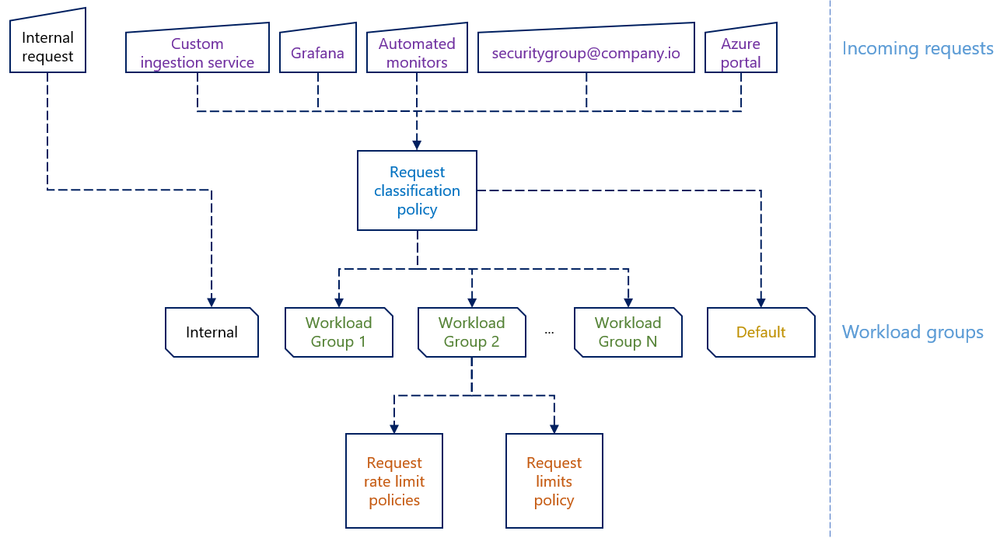

# Workload groups in Kusto (Azure Data Explorer)

*Last modified: 01/25/2021*

[Workload groups](https://docs.microsoft.com/azure/data-explorer/kusto/management/workload-groups){:target="_blank"} allow you to group together sets of requests
(commands and/or queries) that have similar characteristics, and apply policies to control per-request limits and request rate limits for each of these groups.

Classification of requests is done according to custom logic you can define using the Kusto query language.

A Kusto cluster comes pre-configured with 2 [built-in workload groups](#built-in-workload-groups): `default` and `internal`. You can define up to 10 additional custom
workload groups, as well as edit the policies of the `default` workload group.

<p align="center">
  
</p>

* TOC
{:toc}

## When should I define custom workload groups?

### Protection from runaway queries

You may have experienced the problem of a user running a report for a very large date range, unleashing a non-optimized query that could run for several minutes.
These kinds of runaway queries may cause a few performance problems, and you may want to have predefined limits to protect against them.

A workload group's [request limit policy](https://docs.microsoft.com/azure/data-explorer/kusto/management/request-limit-policy){:target="_blank"}
lets you play it safe in these types of cases, by placing a ceiling on the amount of resources and/or the parallelism of the query's execution.
- This can be thought of as a means for *de-prioritizing* certain workloads, while keeping others running in the most optimized manner (the default).

Properties included in the policy allow controlling limits on:

* **Result set size**: ([source](https://docs.microsoft.com/azure/data-explorer/kusto/concepts/querylimits#limit-on-result-set-size-result-truncation){:target="_blank"})
  * Upper bounds for the number of records and the overall data size returned by the service to the client.
* **Amount of memory per iterator**: ([source](https://docs.microsoft.com/azure/data-explorer/kusto/concepts/querylimits#limit-on-memory-per-iterator){:target="_blank"})
  * An upper bound for the amount of memory that a single query plan result set iterator can hold. This limit applies to the specific iterators that aren't streaming by nature (such as `join`).
* **Amount of memory per node**: ([source](https://docs.microsoft.com/azure/data-explorer/kusto/concepts/querylimits#limit-on-memory-per-node){:target="_blank"})
  * An upper bound for the amount of memory that can be used on a single node for a specific query.
* **Execution time**: ([source](https://docs.microsoft.com/azure/data-explorer/kusto/concepts/querylimits#limit-execution-timeout){:target="_blank"})
  * An upper bound for the duration (wall clock time) the request is allowed to run on the server side.
* **CPU resource usage**: ([source](https://docs.microsoft.com/azure/data-explorer/kusto/concepts/querylimits#limit-on-query-cpu-resource-usage){:target="_blank"})
  * Kusto lets you run queries and use as much CPU resources as the cluster has. By default, it attempts to do a fair round-robin between queries if more than one is running.
    * This method yields the best performance for ad-hoc queries.
  * At other times, you may want to limit the CPU resources used for a particular query.
    * For example, if you run a background job, that can tolerate higher latencies.
    * The request limits policy allows you to define a lower percentage (default is `100%`) of threads and/or nodes to use when executing
    distributed sub-query operations.

For requests coming from applications you trust more than others, you can create a dedicated workload group with more relaxed limits.

**Note**: Control commands that include internal queries (such as `.export`, `.set-or-append`) also adhere to the limits in the policy, as long as they run in the context of a
*non*-default workload group. For backwards compatibility, the policy of the `default` workload groups doesn't limit these internal queries.

### Controlling rate of requests

You may have experienced the problem of an automated application running too many concurrent requests, or too many requests during a certain time period.
You are interested in limiting how many concurrent requests that application may run, in addition to the total number of request it may run per hour.

A workload group's collection of [request rate limit policies](https://docs.microsoft.com/azure/data-explorer/kusto/management/request-rate-limit-policy){:target="_blank"} lets you define such limits at
more granular levels than the entire cluster. More specifically, you can define the limits in the scope of a workload group, or for each principal in the scope of a workload group.

Though your Kusto cluster comes pre-configured with limits to protect it (for example, see [Query limits](https://aka.ms/kustoquerylimits){:target="_blank"}), you could change these limits and define
them according to your needs, as well as define which of them can be relaxed by the caller
(in [client request properties](https://docs.microsoft.com/azure/data-explorer/kusto/api/netfx/request-properties){:target="_blank"}), and which of them may not be relaxed.

Rate limits you can define per workload group, or per principal in the scope of a workload group:

* **Maximum concurrent requests**: The total amount of requests that can run at any given moment.
  * For example: *Any user refreshing a PowerBI dashboard is allowed to run up to 5 concurrent requests*.
* **Maximum request count per time period**: The total amount of requests that can run during a sliding window period.
  * For example: *Any user running ad-hoc queries from the web explorer is allowed to run up to 50 requests per hour*.
* **Total CPU seconds per time period**: The total amount of CPU seconds that can be consumed by requests run during a sliding window period.
  * This limit is enforced based on *post-execution* resource utilization reports of completed requests.
  * For example: *Any user running ad-hoc queries from the web explorer is allowed to consume up to 1000 CPU seconds per hour*.
  * To demonstrate how this limit works:
    * A user has 3 tabs open, and is about to run 3 queries (1 from each tab).
      * Each of the 3 queries is expected to consume 600 seconds of CPU (though, the user doesn't necessarily know that in advance).
    * The user runs the first 2 queries concurrently - both will run to completion, as the limit on 1000 CPU seconds wasn't met when they both started executing.
    * Once both queries complete, the total CPU seconds utilized in the past hour by this user is 1200 (higher than the limit of 1000).
      * Now, when the user will run 3rd query, it will be throttled as the limit of 1000 CPU seconds in the past hour was already exceeded before it began executing.

For requests coming from applications you trust more than others, you can create a dedicated workload group with more relaxed rate limits.

### Shared environments

Imagine a scenario where you have 3 different customer teams running their queries and commands on one shared cluster, and maybe even shared database(s) in that cluster. You might even be billing these customer teams based on their resource usage.

By creating 3 different workload groups, one for each customer team, you can place different sets of limits on each, and monitor the resource usage for each.

**Monitoring resources utilization**

You're interested in getting a periodic report for how much resources each customer team is consuming, so that you can charge them accordingly.
[`.show commands-and-queries`](https://docs.microsoft.com/azure/data-explorer/kusto/management/commands-and-queries){:target="_blank"}
includes a `WorkloadGroup` column in its output, which allows you to aggregate statistics by it, and get a better understanding of how much resources each customer team is consuming over time.

**Note**: *Complete* isolation between workloads can be achieved by setting up a [follower cluster](follower-cluster.md){:target="_blank"}

## Built-in workload groups

### The `default` workload group

Requests are classified into the `default` group, unless the [request classification](#request-classification) policy defines a logic that classifies
them into another workload group that you've defined on the cluster.

You can change the classification criteria so that only some or no requests get classified to the `default` workload group.

You can also change the policies that are defined for this workload group.

### The `internal` workload group

Requests that are run by the service against itself are classified into the `internal` group.

Among others, this includes requests that are run as part of [queued ingestion](https://docs.microsoft.com/azure/data-explorer/kusto/api/netfx/about-kusto-ingest#queued-ingestion){:target="_blank"},
requests that are run as part of internal data management and data grooming (such as [data partitioning](data-partitioning.md){:target="_blank"}), queries run as part of
[update policies](update-policies.md){:target="_blank"}, etc.

You can't change the classification criteria for this workload group.

You can't change the policies that are defined for this workload group.

## Request classification

The classification of incoming requests is based on a user-defined function, that you can define as part of a
[request classification policy](https://docs.microsoft.com/azure/data-explorer/kusto/management/request-classification-policy){:target="_blank"}.
The results of the function is used to classify requests into existing workload groups.

The classification function is defined using the Kusto query language, and allows you to reference an internal symbol, `request_properties`, that includes
metadata properties of the incoming request.

### Example

The following request classification function splits incoming requests into 4 custom workload groups, based on:

* Azure active directory group membership
* The principal identity type (AAD user or AAD application)
* The request database name
* The request type (command or query)
* The (UTC) time of day

```
.alter cluster policy request_classification '{"IsEnabled":true} <|
    case(current_principal_is_member_of('aadgroup=somesecuritygroup@contoso.com'), "Members of some security group",
        request_properties.current_database == "MyDatabase" and request_properties.current_principal has 'aadapp=', "Applications in MyDatabase",
        request_properties.current_application in ("Kusto.WebExplorer", "Kusto.Explorer") and request_properties.request_type == "Query", "Ad-hoc queries",
        hourofday(now()) between (9 .. 17), "9 to 5",
        "default")
```

---

